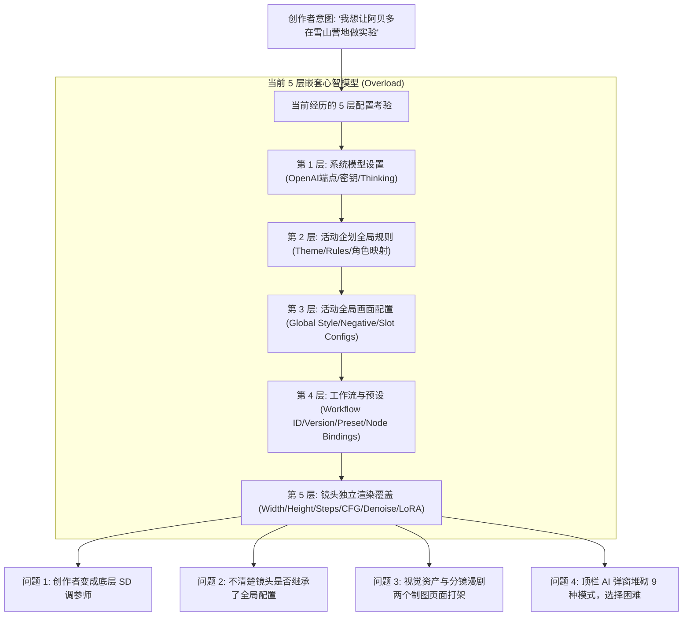
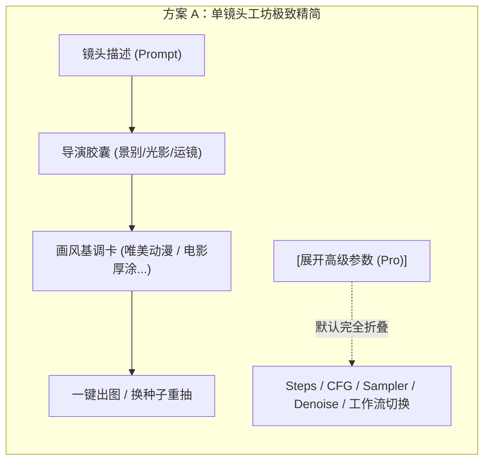
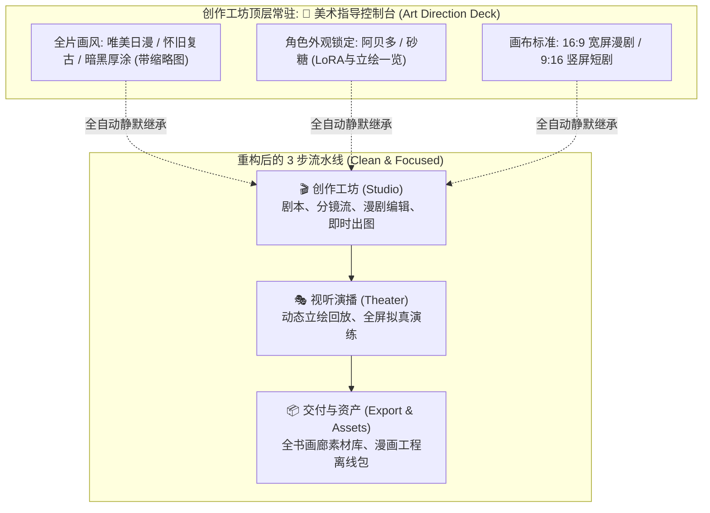
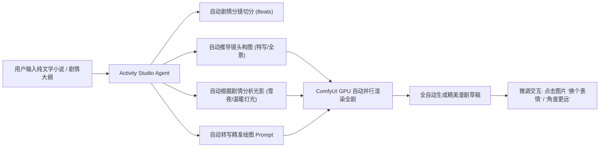
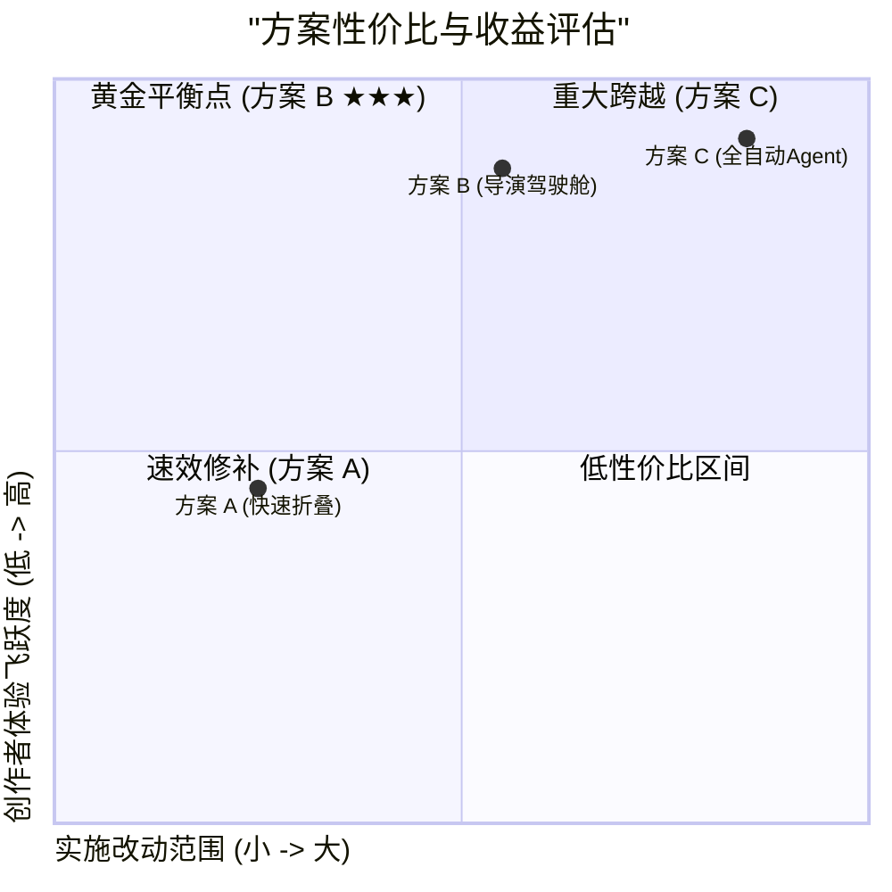

# 活动页面配置体系复杂度分析与优化方案

## 目标简述 (Goal Description)

当前 SthStart 活动系统（Activities）功能完备，覆盖了从企划向导、分幕编排、镜头绘制、漫画排版到视听回放的完整闭环。但随着迭代演进，界面的**配置链路（Configuration Pipelines）**逐渐累积出较高的认知门槛，存在**“配置层级过深、底层机器参数外露、双制图工作台并存、AI 模式入口散落”**等心智负担。

本方案旨在针对创作者反馈的“配置有些复杂”问题，进行系统性痛点剖析，并提出 **3 种渐进式优化方案（方案 A、方案 B、方案 C）**，供您评估决策。**当前阶段仅进行方案探索与对比，不执行任何代码变更。**

---

## 一、现状痛点深度剖析 (Pain Point Analysis)

通过对活动页面核心组件（[`activity-studio-workspace.tsx`](file:///f:/Project/SthStart/app/features/activities/components/activity-studio-workspace.tsx)、[`beat-render-workbench.tsx`](file:///f:/Project/SthStart/app/features/activities/components/beat-render-workbench.tsx)、[`media-workstation.tsx`](file:///f:/Project/SthStart/app/features/activities/components/media-workstation.tsx)、[`generation-modal.tsx`](file:///f:/Project/SthStart/app/features/activities/components/generation-modal.tsx)）的源码排查与真实体验，提炼出以下四大核心痛点：

### 1. 创作者角色与 SD/ComfyUI 调参师角色混淆
在 [`beat-render-workbench.tsx`](file:///f:/Project/SthStart/app/features/activities/components/beat-render-workbench.tsx) 的镜头设置中，直接向创作者暴露了：
- `KSampler`、`Steps` (采样步数)、`CFG`、`Denoise` (降噪幅度)、`Scheduler` (调度算法)
- 底层工作流下拉列表（`anima-activity-1080p-eval`、`activity-beat-sd15-simple`、`Anima 活动插画`）
- **创作者的核心心智是导演与编剧**，关注的是**画风、构图、光影、人物表情**，而不是底层 Diffusion 的数学采样参数。

### 2. 双制图工作台并存带来的信息割裂
- 顶层 Step 3 是 **“视觉资产”**（[`media-workstation.tsx`](file:///f:/Project/SthStart/app/features/activities/components/media-workstation.tsx)），里面有一套“全书媒体插槽”与出图工作台；
- 顶层 Step 1 是 **“分镜漫剧”**，每个镜头右侧又有一套独立的“镜头渲染工坊”；
- 两者在不同页面并行存在，用户常常困惑：“我想要一张插图，究竟是在‘视觉资产’里出，还是在‘分镜漫剧’里出？”

### 3. 全局画风 vs 单镜头配置缺乏清晰契约
- 缺乏一个一目了然的“全片美术指导（Art Direction）”面板。
- 用户在一个镜头里修改了参数，不知道是否会影响后续镜头，也不知道当前镜头到底继承了全局的什么内容。

### 4. AI 批量生成功能入口繁杂
- 顶栏的 `AI 生成` 弹窗（[`generation-modal.tsx`](file:///f:/Project/SthStart/app/features/activities/components/generation-modal.tsx)）塞满了 9 种模式（阶段规划、本幕对话、整场生成、邀请、祝福、朋友圈、续写、配图、局部重写），没有根据创作者当前所处的位置做智能推荐。

---

## 二、三种优化方案对比 (Proposed Options)

针对上述痛点，我们设计了 **方案 A、方案 B、方案 C** 三种演进路线：

| 维度 | 方案 A：极简收敛与渐进式折叠 | 方案 B：以分镜漫剧为核心的「导演驾驶舱」（推荐） | 方案 C：全自动伴写 + 零配置 Agent |
| :--- | :--- | :--- | :--- |
| **定位** | 轻量级、低风险、快速见效 | 中量级、架构理顺、体验质变 | 进阶级、全流程高自动化 |
| **底层改动** | 仅优化当前组件的前端交互与表单展示 | 整合顶层导航（5步变3步），合并媒体与分镜 | 引入自动化大纲分镜与自适应降级管线 |
| **画风管理** | 单镜头折叠底层参数，增加快捷预设卡 | 新增独立常驻的「全片美术风格面板 (Art Deck)」 | AI 全自动根据剧本文本推断画风与光影 |
| **参数暴露** | 默认只露导演胶囊+画风卡，参数 100% 收入 Pro 抽屉 | 彻底隐藏 ComfyUI 参数，与所选风格自动关联 | 仅以自然语言微调（如“角度拉远一点”） |
| **改动范围** | `beat-render-workbench` + `generation-modal` | `activity-studio-workspace` + 整体导航与媒体合并 | 贯穿文本大模型、工作流解析与前后端 |
| **迁移成本** | 极低（1天内） | 中等（2-3天，平滑兼容现有活动） | 较高（需模型微调或特定 Agent 提示链） |

---

## 三、方案详细拆解

### 方案 A：【极简收敛 · 画风胶囊与渐进式折叠】（轻量级）

> [!NOTE]
> **方案核心思想**：不重构页面顶层骨架，只在创作者最高频接触的“单镜头工坊”和“AI生成弹窗”进行激进的**“视觉降噪与渐进式披露”**。

#### 具体实施内容：
1. **彻底把底层参数关进“Pro 抽屉”**：
   - 在 [`beat-render-workbench.tsx`](file:///f:/Project/SthStart/app/features/activities/components/beat-render-workbench.tsx) 中，默认完全隐藏 `steps`、`cfg`、`sampler`、`scheduler`、`denoise` 以及底层工作流下拉框。
   - 界面上只保留：
     - ① **镜头画面描述 & 扩写词**
     - ② **导演视觉胶囊**（景别、光影、氛围，点击即用）
     - ③ **画风预设标签**（如：默认跟随活动、日系动漫、黑白线稿）
     - ④ **出图品质切换**：仅用一个简单的二段按钮替代复杂数值——`⚡ 快速草稿 (15步)` vs `💎 高清成片 (31步)`。
   - 只有极客用户主动点击底部的 `⚙️ 高级配置 (Pro)` 时，才在折叠抽屉中展开原有的机器参数。
2. **状态指示与继承关系透明化**：
   - 在工坊顶部显示醒目标签：`● 继承活动默认画风 (Anima)`，并附带一个 `[修改全局]` 链接，点击弹出抽屉修改活动默认画风，无需跳页。
3. **AI 生成弹窗按场景折叠**：
   - 精简 [`generation-modal.tsx`](file:///f:/Project/SthStart/app/features/activities/components/generation-modal.tsx)，默认只呈现创作者最关心的“本幕生成”与“整场扩写”，其它 7 种衍生文案折入“更多小工具”折叠栏。

---

### 方案 B：【以分镜漫剧为核心的「导演驾驶舱」重构】（推荐方案）

> [!IMPORTANT]
> **方案核心思想**：彻底理顺活动系统的核心轴心。创作者使用活动的真正目的就是**“制作一部互动漫剧/演播剧”**。因此将割裂的 5 步流水线合并为 3 步，并将“全片美术基调”统一收口为可视化控制台。

#### 具体实施内容：
1. **顶层流水线 5 步收敛为 3 步**：
   - **Step 1：🎬 创作工坊 (Studio)**：
     - 作为主页面。原先独立的 `视觉资产 (Media Workstation)` 全面融入分镜工作台。镜头出图产生的资产自动成为活动素材，不再需要两个独立制图页面。
   - **Step 2：🎭 视听演播 (Theater)**：
     - 原 `视听剧场 (Playback)`。用于沉浸式回放和拟真设备预览。
   - **Step 3：📦 交付与资产 (Export & Assets)**：
     - 原 `导出交付` 与 `素材管理` 合并。包含画廊、离线漫画包下载、工程导出。
2. **新增常驻的「🎨 美术指导控制台 (Art Direction Deck)」**：
   - 在分镜工坊顶部常驻一个优雅的风格栏（或抽屉）：
     - **主画风选择**：提供卡片化选择（例如：`原神二次元`、`电影写实`、`水彩治愈`、`黑白热血`），带有直观示例图；
     - **角色锁定栏**：直观展示已绑定的角色头像、对应的 LoRA 状态；
     - **画布规格**：一键切换 16:9 / 3:4 / 9:16。
   - **效果**：用户在此处选好风格后，所有镜头一键生效。单镜头无需再去选择工作流或调参，完全解除心智负担！
3. **单镜头工坊变成纯粹的“导演取景框”**：
   - 镜头界面只留下：**谁出场（角色选择）、剧情发生什么（文本）、镜头怎么拍（导演胶囊）**。
   - 点击“生成分镜”，系统直接利用美术指导配置的底层工作流自动调度 GPU 出图。

---

### 方案 C：【全自动 AI 伴写 + 零配置 Agent 托管】（进阶级）

> [!TIP]
> **方案核心思想**：彻底解放双手，借鉴现代化 Agent 创作理念。创作者甚至不需要手动点选导演胶囊，写好故事直接“一键成剧”。

#### 具体实施内容：
1. **自动化大纲转分镜视觉流**：
   - 创作者输入一段小说或剧情文本（如“傍晚阿贝多和砂糖走进风雪中的雪山帐篷，点亮温暖的炼金灯开始实验”）；
   - 大模型自动解析为 2~3 个分镜镜头，并**自动分配**：
     - 镜头 1：全景（Camp panoramic），雪山黄昏，风雪营地；
     - 镜头 2：中景（Medium shot），二人推开帐篷布帘；
     - 镜头 3：特写（Close-up），炼金桌上试管与发光的结晶石。
2. **自然语言式交互微调 (Click-to-Refine)**：
   - 生成后如果不满意，不需要进设置面板改 CFG 或代码，直接在图片旁点击快捷微调指令：
     - `🔄 换个机位 (俯视/仰角)`
     - `😊 表情微调 (微笑/沉思/惊讶)`
     - `💡 光影切换 (夜晚暖光/清晨逆光)`
   - 系统自动将指令转换为负向/正向差异重绘。
3. **健康检查与自适应降级保障**：
   - 如果某个大模型或底层服务故障（如今日排查的 403 问题），系统内部自动降级切换备用管线，保障出图链路始终可用。

---

## 四、方案优劣与决策建议 (Recommendation)

### 推荐路线：
1. **首推【方案 B】**：
   - 它从根本上解决了“为什么活动页面觉得配置复杂”的问题——因为过去把“视觉资产”与“分镜漫剧”割裂了，并且在镜头上暴露了过多机器级别的选项。
   - 方案 B 将 5 步收敛为 3 步，确立了“剧本分镜”的核心地位，引入“美术指导控制台”让画风一次配置全片通用，真正让创作者拥有“执导一部番剧”的爽快感。
2. **若希望极速见效**：
   - 可以先采纳【方案 A】，在 1 天内将当前镜头工作台的所有底层 ComfyUI 参数折叠进 Pro 抽屉，立刻大幅降低当前界面的视觉压力。
3. **远期演进**：
   - 在方案 B 稳固后，可以逐步引入方案 C 的“一键故事智能分镜化”与“自然语言微调”功能。

---

## 用户确认事项 (User Review Required)

请您审阅上述分析与方案方向：
1. 您更倾向于**方案 A（速效精简折叠）**、**方案 B（驾驶舱重构，推荐）** 还是 **方案 C（全自动伴写）**？
2. 在您的创作习惯中，您更常用的是**自己一格一格写分镜**，还是**从小说章节/大纲一键自动生成**？
3. 在您明确偏好前，我不会执行任何实质性的代码修改。
