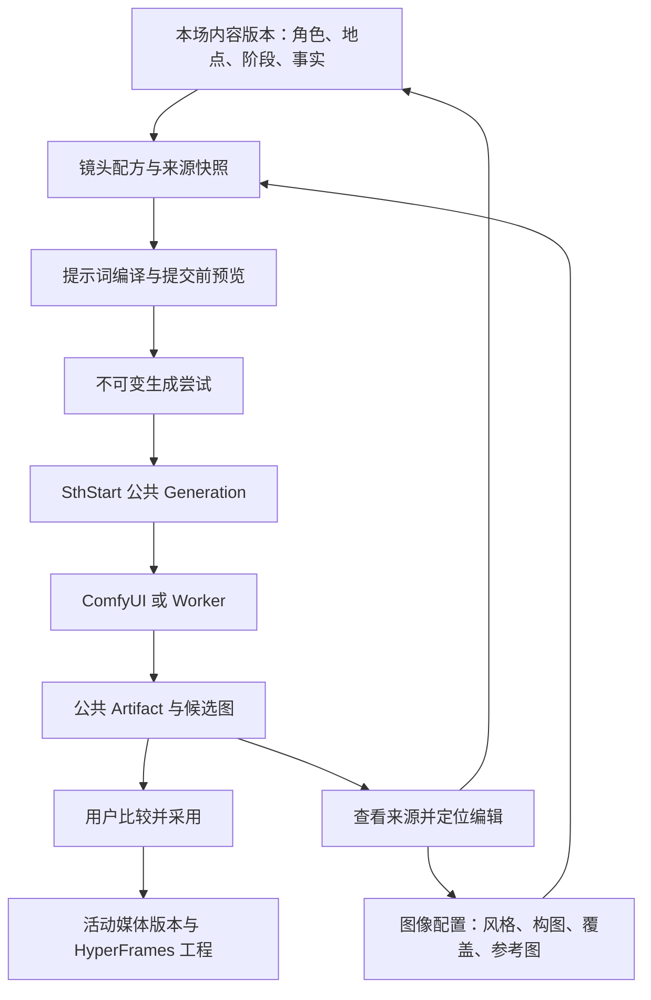

# 活动工作室后续开发计划：ComfyUI 生图、图生图与提示词溯源

文档版本：1.0  
编写日期：2026-09-07  
用途：交给具有本仓库访问权限的开发模型，作为活动工作室的增量实施规格。  
状态：开发计划；本次仅编写文档，未实现或验收本文新增功能。  
配套主计划：[ACTIVITY_STUDIO_IMPLEMENTATION_SPEC.md](./ACTIVITY_STUDIO_IMPLEMENTATION_SPEC.md)。

## 0. 接手说明与优先级

请在现有活动工作室上补齐一条完整闭环：**从活动内容准备镜头 → 预览来源明确的生图提示词 → 调用公共生成服务 → 比较候选图片 → 跳回提示词源头修改 → 再生成 → 采用 → 随活动回溯、打包和再导入。**

这不是另建一个通用 ComfyUI 编辑器，也不是只增加“提示词输入框”和“生成”按钮。用户需要知道一张图为何这样生成，以及改哪里能影响下一张图。

实施口径：

1. 用户后续明确指令优先；本文件细化主计划中媒体、生成、版本和打包部分，其他需求继续按主计划执行。
2. 独立于邻舍，应用身份使用 `activities`。不修改 `upstream/linshe`，不要求邻舍启动。
3. 复用 SthStart 公共 Generation、Artifact、模型配置与管理认证；不在活动页面直接连接 ComfyUI，不向浏览器发送引擎密钥。
4. 用户已选定应用导出 HyperFrames 工程、外部渲染 MP4。本扩展不新增应用内成片渲染服务。
5. 第一交付必须有真实文生图、单参考图图生图、提示词分块来源、跳转修改、历史比较和工程保留溯源的完整闭环。多参考图、局部重绘等按下述阶段推进。
6. 本文类型、路由和表名是建议契约；可适配正在形成的代码，但语义、边界和验收不能省略。不能因名称不同另建平行系统。
7. 所有“已存在”仅指本次检查时观察到的源代码，不等于功能已通过测试。开工先核对工作区及验证结果。

建议先阅读主计划第 2、5、6、10、13、15、16 节，再阅读本文。不要重新实现已完成的活动骨架。

## 1. 用户目标与必须交付的体验

以一场两阶段生日会为例：第一阶段布置会场，第二阶段一起切蛋糕。用户从第二阶段的群聊图片占位卡进入“镜头工作台”，选择两个角色及室内场景。

应用从本场角色外观、服装、阶段行动、镜头构图、画风和用户补充中组装提示词，显示最终要提交的文本和参考图。生成后，用户发现服装不合预期，可点击“服装来自：本场角色 A”跳转到对应字段；保存本场服装修订后，查看受影响镜头，选择重新生成这一张。旧图及旧提示词仍可查看，采用新图后聊天和朋友圈使用新图，已保存的旧版本仍使用旧图。

验收要求：

| 编号 | 需求 | 可观察结果 |
| --- | --- | --- |
| IMG-R01 | 文生图 | 无参考图也能通过已发布、已绑定的工作流生成图片 |
| IMG-R02 | 图生图 | 能选择已有图或上传图，以实际 Artifact 输入工作流 |
| IMG-R03 | 提交前预览 | 显示将提交的提示词、参考图、工作流版本和有效参数 |
| IMG-R04 | 来源分块 | 人物、服装、场景、行动、构图、风格、补充各有来源或明确标识为手工/AI 推导 |
| IMG-R05 | 点击定位 | 来源入口能定位本场具体角色、阶段或镜头字段，显示对应历史值 |
| IMG-R06 | 编辑范围 | 区分单次覆盖、镜头默认、本场设定；不会误改公共人设 |
| IMG-R07 | 修订影响 | 修改源头后显示哪些镜头需复核，不自动批量生图 |
| IMG-R08 | 不可变记录 | 每次生成保存来源、编译结果、参数与参考图快照，不被后续修改覆盖 |
| IMG-R09 | 候选与采用 | 生成成功只增加候选；用户采用才修改媒体选片版本 |
| IMG-R10 | 图片派生关系 | 能从新图追到输入图、处理操作、父生成尝试及当时参数 |
| IMG-R11 | 重启与幂等 | 重复提交、迟到结果、刷新和服务重启不造成错绑或重复生成 |
| IMG-R12 | 归档与导入 | 工作工程携带完整范围内的提示词来源及参考媒体，导入后能查看历史并创建新尝试 |
| IMG-R13 | 能力如实呈现 | 未绑定、无节点、参数不支持、引擎不可达等有区别，不用统一“可用”掩盖 |
| IMG-R14 | 不破坏已有应用 | 公共服务改动对创作中心、角色库、叙事档案保留兼容 |

## 2. 当前仓库基线与具体缺口

### 2.1 本次观察到的实现

工作区已有活动相关改动，包括 `apps/service/src/activities/`、`packages/contracts/src/activities.ts`、`packages/activity-playback/` 以及公共路由、数据库、消费者的修改。它们可能来自其他开发任务。不要清理、覆盖或回退这些未提交内容。

| 文件或模块 | 当前观察 | 增量工作 |
| --- | --- | --- |
| `apps/service/src/activities/media.ts` | 有上传、关联 Artifact、创建媒体任务、同步输出、选片函数 | 增加准备配方、图生图输入、不可变尝试、来源关联和归属校验 |
| `apps/service/src/activities/routes.ts` | 有 `media-jobs`、`media-selection`；capabilities 返回 `media: true` | 扩展现有路由并按实际工作流返回能力 |
| `packages/contracts/src/activities.ts` | Actor 有 `outfitDescription`、`appearanceReferenceAssetKeys`；MediaSlot 有 `shotDescription`、`actorIds`、`sourceFactIds` | 复用字段，新增图像配置、来源块与执行快照契约 |
| `apps/service/src/generation/consumers.ts` | 已出现 `activities` 注册项 | 核对生效及分配，不重复添加 |
| `apps/service/src/generation/execution.ts` | `createGenerationTask` 支持 inputs、inputArtifacts、seed、retryOf、幂等 | 在活动调用侧补齐；必要时小范围增加冻结/原子关联接口 |
| `apps/service/src/generation/inputs.ts` | 最多 4 个输入媒体、inputKey 不重复；严格校验 app 所有权 | 首版支持单输入；多图按不同输入键映射；跨 app 素材需要显式处理 |
| `apps/service/src/generation/workflows.ts` | 标量输入按 nodeBindings 填入节点；seed/noise_seed 另行覆盖 | 提交前验证参数真正有作用，记录种子实际绑定策略 |
| `apps/service/src/generation/task-store.ts` | 解析已发布工作流与引擎；仅接受 comfyui/worker | 不假定已有云端图片 API 执行能力 |
| `apps/service/src/creative.ts` | 有文生图、图生图调用方式与任务 replay 摘要 | 参考底层使用方式，不借用 creative-center appId |
| `apps/service/src/activities/exports.ts`、`imports.ts` | 已有活动打包/导入草案 | 增加溯源依赖、版本迁移和 ID 重映射；先验证基础打包能力 |

### 2.2 必须优先处理的接入问题

1. 当前 `CreateMediaJobParams` 和活动媒体路由只暴露原始 `inputs` 等字段，没有完整传递 `inputArtifacts`、`seed` 和业务来源。单纯传图片 URL 不能完成当前公共图生图输入流程。
2. 当前公共任务先创建并调度，活动随后写入 `activity_media_job_links`。应消除两步之间崩溃造成的孤立任务窗口。
3. 当前 link 的 `ON CONFLICT(task_id, slot_id) DO UPDATE` 会改写来源版本和 fingerprint。历史生成来源应不可变；同键重放应返回原关联，不得改绑。
4. 当前公共幂等键范围为 `(app_id, idempotency_key)`。所有活动同属 `activities`，必须在服务端加入 activityId/attemptId 等命名空间，同时校验业务请求哈希。
5. 当前关联外部 Artifact 的方法涉及授予 reference 访问；而 Generation 输入仍要求 Artifact 的 `app_id === activities`。能在画廊查看或关联，不代表能直接作为生成输入。更不能由普通关联接口仅凭用户提供的 ID 就替所有者授予权限。
6. 当前直连 ComfyUI 输入上传仅支持图片；worker 是另一执行路径。视频/音频不能通过这个新增图片入口假装获得支持。
7. `workflow_snapshot_json` 保存的是初始编译图。输入图片上传后的受控文件名会在准备步骤写入另一个图对象，不能把初始快照标成“最终发送请求”。
8. `renderWorkflowSnapshot` 对未绑定的标量输入可能不产生效果。UI 不应展示一个看似可调、实际上没连到节点的 denoise/steps/尺寸参数。
9. 当前导出草案存在整体读入媒体 Buffer、按媒体大类选扩展名的实现。扩展溯源时须按主计划验证真实 MIME、流式大包和缺失文件处理，避免额外参考图放大问题。

以上是实施前需要核对并修正的风险点，不构成对活动应用整体完成度的评审。先记录基线，再把与本扩展有关的问题纳入任务。

## 3. 架构与职责



职责必须明确：

- 活动服务：解释剧情、解析活动内来源、组织镜头、保存尝试、追踪影响、采用选片、工程溯源。
- 公共 Generation：工作流与引擎解析、输入文件准备、执行、任务状态、取消/恢复、输出入库。
- 公共 Artifact：文件、MIME、哈希、访问、引用和保留。
- 公共 LLM：可选的镜头描述优化、提示词改写/翻译。生成提示词草稿与执行图片是两个步骤。
- 前端：可编辑的配方、最终提示词预览、来源定位、候选比较。只调用管理 BFF。

不要复制一套任务队列、ComfyUI WebSocket 客户端或文件存储到活动目录。允许在公共层增加经过回归验证的窄接口，不把活动对象塞进公共引擎的业务逻辑。

## 4. 交付范围与后续阶段

| 阶段 | 必须交付 | 说明 |
| --- | --- | --- |
| I1，首个完整交付 | 文生图、单参考图图生图、确定性组装、来源定位、作用范围、比较采用、历史与打包 | 覆盖核心用户需求，不以纯 API 或静态界面代替 |
| I2，创作效率增强 | AI 分块改写/翻译、块锁定、多参考图能力映射、批量准备/选择提交、差异比较增强 | 在 I1 稳定后继续，不必等全部增强才能交付 I1 |
| I3，按真实工作流扩展 | Mask 局部重绘、局部编辑器、放大、姿态/构图控制 | 必须先有可用工作流和样例；不硬承诺所有模型支持 |
| I4，独立可选扩展 | 云端图片模型 API、新视频生成适配 | 在公共 Generation 增加适配器，不混入 I1 的活动代码 |

I1 必须有“提示词修改能影响实际请求”的验收。I2/I3 不可只画入口然后宣称完成；没有工作流时显示不可用原因或不展示操作。

多角色一致性依靠角色参考、服装约束、支持的工作流和选片迭代改善。文本写入两个人名不等于模型能稳定识别两个角色；不把图像质量承诺写成确定性保证。

## 5. 页面与交互

### 5.1 入口

以下位置都能打开同一镜头工作台：聊天图片占位/已有图片、朋友圈配图、阶段镜头列表、活动素材库的关联镜头。一个 slot 可被多条记录引用；UI 应说明“替换后影响这些记录”。

自由上传的图片可能没有生成来源。展示“手动上传”和导入信息，允许“以此图继续生成”，不捏造提示词。

### 5.2 镜头工作台

推荐桌面布局：左侧来源与镜头设定，中间最终提示词及参考图，右侧候选图与参数。窄屏使用标签页；第一版无需建设节点画布。

应包含：

- 画面目标：参与角色、实际行动、地点、时间、景别、构图、视角、表情、氛围。
- 生成模式：文生图/图生图；工作流及已发布版本；引擎由管理配置解析。
- 参考图：缩略图、用途、对应角色、真正输入键；图生图至少一个初始输入。
- 提示词块：人物身份与外观、服装、场景、动作、构图、画风、补充、支持时的负面约束。
- 最终提交预览：实际正向/负向或多通道文本，不仅显示中文摘要。
- 参数：只展示有证据支持的项目；可展开查看实际绑定信息。
- 候选历史：每次尝试状态、缩略图、来源修订、参数差异、父图、采用位置。

主要动作：保存镜头草稿、准备提示词、生成、取消本任务、查看来源、比较、采用、恢复历史图、以此图继续生成。

### 5.3 来源定位

示例来源标签：

| 显示内容 | 定位对象 | 默认编辑位置 |
| --- | --- | --- |
| 发色来自“本场角色·澄” | actorId + 本场内容修订 + persona 对应字段 | 本场角色编辑器 |
| 服装来自“本场角色·澄” | actorId + outfitDescription | 本场服装字段 |
| “一起切蛋糕”来自“阶段二” | stageId 或 factId + 来源修订 | 本场阶段/事实编辑器 |
| “暖色室内灯光”来自“本场画风” | imageConfigRevisionId + style 字段 | 本场图像配置 |
| “俯视近景”来自“镜头 03” | slotId + 镜头配置修订 | 镜头构图字段 |
| “背景去掉气球”来自“本次覆盖” | attempt/recipe + overrideId | 新尝试中的覆盖字段 |

点击旧图的来源先展示“当时值”和“当前值”，再提供编辑当前版本的入口。历史页不允许直接写旧快照。对象已删除时仍显示冻结值，并可复制到新镜头/新草稿。

导航使用受控 source kind 与稳定 ID 构建路由；不要把数据库保存的任意 URL 当跳转地址。定位时展开对应面板并高亮字段，关闭后返回原镜头并保留滚动位置。包含未保存修改时沿用应用草稿处理机制。

### 5.4 编辑作用范围

| 范围 | 行为 | 默认 |
| --- | --- | --- |
| 本次尝试 | 只改变即将提交的配方，例如“去掉这张图背景的气球” | 从候选图发起小修时默认 |
| 当前镜头 | 保存为该 slot 后续准备提示词的设定 | 编辑构图、景别时默认 |
| 本场设定 | 修改本场角色服装、地点或阶段事实，分析受影响镜头 | 点击对应源头时默认 |
| 公共资料 | 修改共享人设/全局预设 | 不在本场自动执行；如提供独立入口，使用公共编辑流程 |

输入框旁边持续显示作用范围，不只在提交弹窗出现。用户手动改了最终提示词后，不反向猜测并改写角色资料。可以提供“另存为镜头覆盖”，但同步到源头必须是明确操作。

### 5.5 修改与生成之间的边界

保存来源、保存镜头草稿、准备提示词和真正生图是不同操作。保存不触发生图。批量操作展示镜头数量、工作流、尺寸和已有运行中任务；没有可靠价格时不显示虚构费用估算。

一键复用上一轮参数时显示“复用旧输入”，而不是暗中用当前角色快照重编译。以当前设定生成则重新准备配方，并显示和上次差异。

## 6. 数据模型与版本关系

### 6.1 命名和核心对象

以下为新增或扩展对象；沿用主计划的 `contentRevisionId`、`slotId`、`assetKey`、`mediaRevisionId` 和 `headVersion`。

| 对象 | 可变性 | 职责 |
| --- | --- | --- |
| ImageConfigDraft | 可变，独立 draftVersion CAS | 本场画风、按 slot 的镜头配方默认值、编辑中的参考图 |
| ImageConfigRevision | 不可变 | 已保存图像配置快照，与本场内容分离，避免画风变化污染剧情 |
| PromptRecipe | 不可变 | 一次准备时冻结的来源、覆盖、引用图和内容/配置版本 |
| PromptCompilation | 不可变 | Recipe 编译/改写后的文本、块映射、模板/模型版本 |
| GenerationAttempt | 归属不可变，执行状态可更新 | 一次用户生图意图，连接配方、编译、公共任务与输出 |
| ExecutionSnapshot | 分阶段追加 | 已解析工作流、有效输入、上传绑定、最终请求摘要、可得运行环境 |
| AssetLineageEdge | 不可变 | 某输出使用了哪些输入、做了什么预处理、源自哪次尝试 |
| SourceDependency | 从快照构建的索引 | 按来源查受影响镜头，可重建，不是历史事实唯一存储 |

不要把所有历史文本放进 Artifact 的通用 metadata；Artifact 只需稳定标识和必要溯源入口，业务关联属于活动表。

### 6.2 与主计划的版本兼容

内容、媒体、回放仍是活动头部的三个主版本。新增图像配置放在媒体子系统内：

- `MediaRevision` 可增加可空 `imageConfigRevisionId`。保存图像配置创建新配置修订，并以相同选片创建新媒体修订，通过 headVersion CAS 更新活动头。
- 恢复旧 checkpoint 时，随媒体修订恢复所关联的图像配置；旧项目没有该字段时迁移为“无历史图像配置”，不能捏造曾使用的提示词。
- 配置草稿不进入历史成品；正式准备/执行必须固定内容修订、图像配置修订及其哈希。用户使用草稿时先明确保存对应修订，再准备。
- GenerationAttempt 自身保留精确配方，不依赖“当前配置”重建过去。
- 仅改画风、种子或构图不会改聊天文本与活动事实。只改配置且选片相同的媒体修订，应复用有效回放或仅更新其版本引用，不强制重做动画。
- 修改本场服装、地点、阶段行动通过内容修订流程；相关性检查与已有下游 needs_review 机制衔接。

若现有代码已采用等价设计，可继续沿用，但必须保证 checkpoint 能恢复图片创作配置且不覆盖旧尝试。避免增加一个没有恢复语义的孤立“当前提示词”字段。

### 6.3 SourceRef

每个来源引用至少包括：

```typescript
type SourceRef = {
  id: string;
  activityId: string;
  ownerKind: 'content' | 'image_config' | 'recipe';
  ownerRevisionId: string;
  entityKind: 'actor' | 'stage' | 'fact' | 'activity' | 'shot' | 'style' | 'override';
  entityId: string;
  fieldPath: string;
  valueSnapshot: unknown;
  valueHash: string;
  labelSnapshot: string;
};
```

`fieldPath` 是相对于已通过 ID 解析的对象的受控路径，例如 `/outfitDescription`。不要用 `/actors/2/...` 作为永久来源；角色重排后下标会变化。字段枚举/路径解析不允许任意对象写入与原型污染。

若 `persona` 仍为松散 Record，先建设小型外观读取适配器，读取已支持的人设字段并保留具体路径。没有外观资料时标记缺失并允许用户补充；不能把显示名当完整角色形象描述。

### 6.4 PromptBlock 与改写过程

```typescript
type PromptBlock = {
  id: string;
  kind: 'identity' | 'appearance' | 'outfit' | 'scene' | 'action'
    | 'composition' | 'style' | 'negative' | 'supplement';
  actorIds: string[];
  sourceRefIds: string[];
  originalText: string;
  renderedText: string;
  origin: 'source' | 'manual' | 'ai_derived';
  locked: boolean;
  mappingPrecision: 'exact_block' | 'derived_block' | 'whole_prompt';
};
```

一个块可来自多个字段，一个字段可参与多个块。只承诺语义块级来源；经 AI 改写后不能伪造逐字精确对应。

每次编译记录 compilerVersion、模板 ID/版本、块顺序、输入/输出文本及哈希。AI 改写额外记录 provider/model 标识、配置版本或安全摘要、实际请求消息与响应、时间、可得 requestId；不保存凭据，不采集隐藏推理。一次编译使用确定的输入，保存结果后提交图片时不再次调用 LLM 改写。

### 6.5 ReferenceInput

每个输入包含 `referenceId`、`assetKey`、解析后的 artifactId、SHA-256、角色关联、用途、工作流 inputKey、可选父尝试 ID 和预处理记录。

用途建议枚举：`init_image`、`identity`、`outfit`、`composition`、`pose`、`style`、`mask`。这是产品语义，只有映射到真实节点输入才算生效。若工作流只有 sourceImage，则只能承诺它作为初始图，不能声称额外提供了身份控制。

预处理记录包含原始输入、输出 Artifact、裁切矩形及坐标系、旋转、缩放尺寸、插值方式、色彩/方向处理版本、mask 关系。只保存裁切参数而实际发送原图不算完成。

### 6.6 GenerationAttempt 与指纹

尝试至少包含：activityId、attemptId、baseContentRevisionId、imageConfigRevisionId、slotId、slotFingerprint、recipeId、compilationId、recipeHash、executionPlanHash、taskId、retryOfAttemptId、parentAttemptIds、idempotencyKey、businessRequestHash、createdAt，以及输出关联。

区分三种哈希：

1. `slotFingerprint`：剧情语义兼容性，包括人物、画面事件、地点等。服务端基于固定内容版本计算，不信任客户端传入值。
2. `recipeHash`：来源值、覆盖、参考图哈希、文本编译、图像配置等完整创作输入。
3. `executionPlanHash`：实际工作流版本/定义哈希、引擎身份、参数、输入绑定和种子策略。

现有 fingerprint 算法如变化，增加算法版本，旧值按旧算法校验。禁止因字段重命名就把历史媒体全部视为不可用。

不要把后续产物的描述自动写成活动事实。图像可作为视觉候选，事实仍来自已采用内容。

### 6.7 存储建议

按现有约定追加迁移，建议表族：

| 表 | 关键约束 |
| --- | --- |
| activity_image_config_drafts/revisions | activity 归属、draft CAS；revision 不可变 |
| activity_prompt_recipes | activity/content/config/slot 归属、JSON 快照、hash、schemaVersion |
| activity_prompt_compilations | recipe 归属、compiler 版本、块与输出快照 |
| activity_image_attempts | UNIQUE(activity_id, idempotency_key)，原始关联不可更新 |
| activity_image_execution_snapshots | attempt + phase 唯一；各阶段只追加一次或按明示重试分支追加 |
| activity_image_attempt_outputs | attempt、task output 标识、assetKey；重复同步不产生重复资产 |
| activity_image_lineage | 有向边、输入用途、transform 快照，禁止环 |
| activity_image_source_dependencies | 来源 kind/ID/path 索引，指向 recipe/slot，可重建 |

扩展现有 `activity_media_job_links` 引用 attempt，保留老任务迁移兼容。跨活动引用必须通过服务端检查或复合外键约束，单独 UUID 外键不足以证明同一活动。

不把每个 SourceRef 都做成独立修订系统。快照 JSON 为历史真相，关系表用于检索和生命周期。

## 7. 提示词准备算法

### 7.1 确定性组装是基础路径

按以下顺序处理：

1. 验证活动、内容修订、slot、角色、相关事实及图像配置归属。
2. 只读取此镜头涉及的角色和本场当时已知内容，避免整个人设库或后续剧情全部进入提示词。
3. 解析外观、服装、场景、动作、构图、画风、负面约束和手工补充；建立 SourceRef 快照。
4. 应用明确的覆盖规则，构建 PromptBlock；未提供字段允许为空并显示缺失，不自动编造关键外观。
5. 确认角色指代。多人物块分别保留 actorId 和位置/动作，避免所有服装描述混在同一串中。
6. 使用固定版本模板组装目标工作流的输入通道。可能是一份 prompt，也可能是多个编码节点/角色输入，不能硬编码只有 positive/negative 两个字符串。
7. 验证长度、必需项、支持的输入键、引用图及参数绑定；未知/未生效参数阻止提交或要求用户明确删除，不静默丢弃。
8. 保存 recipe + compilation，返回最终输入预览、来源和能力检查。

覆盖优先级建议为：本次显式覆盖 > 当前镜头设定 > 本场图像默认；角色外观、服装和剧情事实按明确字段覆盖，不能用“优先级高”无声解除剧情锁定。发现动作与锁定事实矛盾时让用户选择修订内容或保留镜头为视觉改编，保留该选择记录。

### 7.2 AI 改写、翻译与锁定

I2 增加可选 AI 改写：输入结构化块，要求返回块 ID、改写文本、sourceRefIds、推导说明以及冲突列表；服务端验证引用只来自输入集合。

- 锁定块由服务端原样保留，不能只靠“请勿修改”的提示词。
- 改写失败、超时或不合法时保留原始块，可继续使用确定性组装；不悄悄换一套设定。
- 翻译同时保留原文和实际提交语言。翻译造成信息遗漏时可单块手动修订。
- 手工整段编辑使精细映射失效时，将精度降为 whole_prompt，仍保留原配方作为上下文来源。
- 记录模板演进，不使用当前模板重建历史请求。

### 7.3 多层执行来源

“提示词已溯源”应分级显示：

| 层级 | 保存内容 | 可得性 |
| --- | --- | --- |
| 业务来源 | 本场字段快照、镜头覆盖、引用图 | 本应用必须完整掌握 |
| 编译输入 | 最终文字块与有效参数、模板和改写版本 | 本应用必须完整掌握 |
| 发送边界 | 上传完成后实际提交的图/请求正文，或可验证的安全快照与哈希 | 公共层增加合适记录点 |
| 引擎内部 | 自定义节点内部再次改写、插件内部参数、运行模型细节 | 仅在引擎返回或工作流显式输出时保存 |

引擎内部信息缺失时标明“未提供”，不能把发送边界说成模型内部最终文本。可为可控工作流增加输出提示词的节点声明，但不能自动替用户改写现有已发布图。

## 8. 公共 Generation 接入

### 8.1 用途与能力

建议新任务分配区分 `activity_image_text`、`activity_image_edit`；它们是拟新增的 purpose 值，必须核对公共管理页面和数据库允许范围。旧 `activity_media_slot` 保留用于历史任务，不能重写旧 purpose。

如仓库已提供等价用途，沿用即可。兼容旧绑定时仅在验证工作流具备目标模式后显式提供迁移/复用，不根据名字猜测它是图生图。

能力响应至少区分：

- `configured`：分配存在且引擎启用。
- `workflowValid`：已发布版本可解析，必需输入/输出和节点绑定合法。
- `readiness`：ready / unreachable / incompatible / unknown，并附检查时间与原因码。
- 模式、参考图键/数量/媒体大小、支持的参数/范围/默认值、输出类型。

I1 至少读取配置并执行有界连通/兼容检查。对自定义模型和插件是否全部安装，无法证明时保留 unknown；不能因端口响应成功宣布工作流必能运行。探测不提交计费或 GPU 生成任务。

### 8.2 文生图与图生图

活动服务调用 `createGenerationTask`，至少传递：

```typescript
{
  appId: 'activities',
  purpose: resolvedPurpose,
  workflowId: frozenWorkflowId,
  workflowVersion: frozenWorkflowVersion,
  inputs: compiledBoundInputs,
  inputArtifacts: preparedReferences.map(r => ({
    artifactId: r.artifactId,
    inputKey: r.inputKey,
  })),
  seed: resolvedSeed,
  idempotencyKey: scopedGenerationKey,
  retryOf: parentTaskId,
}
```

上述是语义示例；只有当前接口支持的字段可直接传入。当前 `CreateTaskOptions` 没有独立 engineId 字段。如果要冻结引擎，需要公共层新增小范围可验证能力，或在原子创建时校验已解析绑定仍等于预览快照；不能假装传入无效字段便完成固定。

I1 图生图的典型输入键可为 `sourceImage`，实际以工作流绑定为准。不能依赖 URL 字符串、base64 或外部路径绕过 Artifact 输入管理。

### 8.3 参数与种子

参数依据已发布 inputSchema、nodeBindings 和实际执行策略生成：

- width/height/steps/denoise 等只有存在有效节点绑定时才是可调参数。
- 输入模式不支持 negativePrompt 时不把它作为独立已生效字段显示；若转换为正向限制，明确记录转换。
- seed 当前公共层会覆盖多个节点中的 seed/noise_seed；预览和历史应说明该策略。首版沿用并记录，不承诺每个节点独立随机种子。
- 用户选随机种子时，在准备可提交快照时解析出具体值，提交使用该值，避免预览与执行不一致。用户点“换随机种子”创建新准备结果。
- JSON 数字需要安全整数和工作流范围验证；如支持更大种子，必须端到端设计序列化，不损失精度。
- 使用同一输入和 seed 仅代表尽量复现。引擎版本、模型文件、插件、硬件差异仍可能影响输出；保存可得版本/哈希并区分未知。

### 8.4 跨应用参考图片

I1 建议采用“导入为活动输入”策略：先通过已有所有者/管理权限校验用户可读取原图，再通过 Artifact 层建立 activities 所有的受控输入副本或符合现有存储机制的逻辑副本，保留来源 Artifact 和哈希。

物理文件是否去重交给 Artifact 实现决定。禁止直接 UPDATE 原 Artifact 的 app_id，禁止仅凭图片 ID 自动授权，也禁止因为都是 activities app 就忽略不同活动的业务归属。

公共层若以后支持有授权的跨 app 生成输入，可单独改造 `validateInputArtifacts` 和执行时校验，补回归测试后减少复制；不把放宽所有权检查作为最快路径。

### 8.5 原子关联与恢复

推荐给公共任务创建增加一个小范围的“入库事务内同步关联”扩展点，或提供等价的事务式 enqueue：

1. 活动侧准备并校验不可变 recipe、compilation、executionPlan。
2. 在同一 SQLite 事务内创建或复用业务 attempt、公共 generation task、input 引用及 activity link。
3. 关联写入失败，整个新建任务事务回滚；调度只能在事务提交后触发。
4. 同幂等键同业务哈希返回原 attempt 和原 task；不同内容返回 409。
5. 公共代码只提供同步事务接口，活动归属逻辑留在活动模块。不得在 SQLite 事务内等待网络或运行模型。

若当前存储层难以做到同事务，可用持久提交意图 + 恢复扫描：先写冻结 attempt，再用其稳定命名空间键创建公共任务，重启时从相同键寻找并补关联。必须证明崩溃于每个步骤都不会重复执行或改绑，不能用“失败时删除任务”掩盖窗口。

提交前再次检查当前预览依赖与 assignment。如果 changed，返回 `preview_stale` 或 `assignment_changed`，展示差异并重新准备；绝不默默换引擎/工作流。用户可以明确从历史快照发起新尝试。

### 8.6 执行快照与未知结果

在输入上传完成、实际发送前记录最终 payload 的哈希和安全快照，保留 artifactId → 受控上传名 → node input 的映射。对可能含凭据的自定义节点，遵循现有工作流密钥校验；如确需脱敏，标明 redacted 和缺失字段，不声称逐字完整复现。

公共运行状态是执行事实的权威；业务状态只表示 preparing/submitting/linked 等协调阶段，不另造一个会与任务状态矛盾的轮询队列。

提交超时而上游可能已接收时沿用公共层未知结果与对账逻辑。应用不能自动另发一遍请求。取消单个任务不调用会误停其他应用任务的全局中断接口；显示 cancellationScope/upstreamMayContinue 等真实信息。

## 9. 候选、采用与来源修订

### 9.1 候选输出

一个 attempt 可有多个输出，使用 task output 标识、序号和 Artifact 标识建立映射，不以缩略图排序推断生成顺序。中间预览图与最终可采用图应按工作流输出声明区分。

重复同步必须幂等。公共任务查询需先通过 activity → attempt → task 关联验证，不能只用 `getGenerationTask(..., 'activities')` 作为活动级权限证明。

### 9.2 采用

采用请求包含 expectedHeadVersion、当前 contentRevisionId、slotId、candidate assetKey。服务端核对：

1. 活动及候选归属正确，文件可用，媒体类型适合该 slot。
2. slot 仍存在，当前剧情 fingerprint 与尝试来源的兼容性可解释。
3. recipe 是否受当前源头修改影响。如果仅旧画风/旧构图，显示差异，可明确采用旧图；如果人物/事件已变化，要求显式处理不匹配。
4. 创建新媒体修订，旧图不删除，不让“同步成功”自动采用。
5. 回放引用不再满足尺寸/时长/类型要求时标记需检查，不能静默输出损坏工程。

### 9.3 影响分析

保存源头后，按稳定实体 ID + 字段路径查依赖，比较引用值哈希，而不是只比较整个活动 revisionId：

- 与该字段无关的镜头不标记。
- 人物/服装/地点/行动变化标记内容相关的媒体需复核。
- 画风、构图、参考图、模型参数变化标记图像配方需更新。
- 被单次覆盖完全替代的来源，可记录为上下文依赖而非有效生成依赖，避免虚假的必需重生成。
- 所有状态是待处理提示，不直接使旧图消失或自动提交。

影响面板列出旧值、新值、镜头、已采用/未采用状态、是否有运行中尝试。用户可选择准备全部受影响镜头、仅准备部分、保留旧图并记录已审阅。

“已审阅保留”必须绑定当前 dependency hash。以后源头再变化，应重新提醒，不能永久忽略。

### 9.4 分支与恢复

切回旧活动版本时显示该版本对应图像配置和选片。历史 attempt 仍可浏览；恢复不重新运行任务，也不让旧运行任务自动覆盖恢复后的头。

从旧图继续图生图创建新 attempt，父关系指向旧输出。修改源头后重新生成也创建新 attempt，不 UPDATE 老 recipe。历史源头不存在时，从快照复制创建当前草稿，保留来源关系。

## 10. 图生图派生链与增强能力

### 10.1 单参考图，I1

选择/上传原图 → 检查 MIME/大小/解码 → 保存输入 Artifact → 选择支持的图生图工作流 → 设置实际支持的参数 → 预览文本与原图 → 生成候选 → 比较/采用。

必须保存原图文件及哈希。即使生成任务清理，活动历史或工程仍引用的输入图不能被清理掉。上传失败、原图损坏或过大时在提交前阻止并给出具体原因。

### 10.2 多参考图，I2

公共层当前最多 4 张且 inputKey 唯一。以工作流声明的不同键分别映射身份、服装、构图等；实际允许数量取产品、公共层、工作流三者最小值。不能在一个 sourceImage 键下提交数组假装已有支持。

多图 UI 应显示每张图对应角色和用途。不支持某用途时可以改成普通 init_image 或换工作流，但不能静默忽略。

### 10.3 裁切、Mask 与放大，I3

- 原图与预处理图都作为 Artifact 保留，lineage 记录变换；保存后重新打开能还原编辑选择。
- Mask 记录与哪张图对齐、黑白/透明通道语义、分辨率和方向；这些语义来自工作流 profile，不统一猜测。
- 输出分辨率、采样和放大参数按真实流程显示，不把网页 CSS 放大当图像超分。
- 优先做一个已验证工作流的端到端交互，再扩展适配，不在 I1 构建 Photoshop 式编辑器。

建议派生链展示：原图 → 调整构图 → 修改服装 → 放大 → 已采用。多输入时允许多个父节点，底层为 DAG，UI 第一版用时间线加父图列表即可。

## 11. API 与前后端契约

API 沿用管理 BFF：浏览器 `/api/admin/...` 对应服务 `/api/v1/admin/...`。下表路径相对于 `/api/v1/admin/activities`，是建议增量；已有等价接口应扩展复用。

| 方法与路径 | 作用 | 关键约束 |
| --- | --- | --- |
| GET `/capabilities` | 增加 images 能力对象 | 配置/探测/输入绑定分开，兼容旧字段消费者 |
| GET/PUT `/:id/image-config/draft` | 读取/保存配置草稿 | expectedDraftVersion；保存不生成 |
| POST `/:id/image-config/revisions` | 保存配置修订并更新媒体关联 | expectedHeadVersion、expectedDraftVersion |
| POST `/:id/image-recipes/prepare` | 确定性编译预览 | content/config/slot 固定，输入引用由服务端解析 |
| POST `/:id/image-recipes/:recipeId/rewrite-jobs` | I2 可选 AI 改写 | 幂等、持久状态、显式采用改写结果 |
| GET `/:id/image-recipes/:recipeId` | 查看冻结来源与编译 | 同活动归属 |
| POST `/:id/media-jobs` | 从已准备快照创建生图尝试 | compilationId、executionPlanHash、业务幂等 |
| GET `/:id/image-attempts` | 按 slot 查询历史 | 分页，包含 task 状态与输出摘要 |
| GET `/:id/image-attempts/:attemptId` | 查看溯源与执行详情 | 不返回凭据和私有文件路径 |
| POST `/:id/image-attempts/:attemptId/retry` | 新尝试复用旧输入 | 新幂等键，记录 retryOf，不覆盖原任务 |
| POST `/:id/image-attempts/:attemptId/cancel` | 取消或请求取消 | 转发公共任务真实语义 |
| POST `/:id/image-impact/preview` | 预览源头修改影响 | 固定 before/after 修订，不产生任务 |
| POST `/:id/image-sources/resolve` | 返回历史值、当前值与受控定位描述 | SourceRef ID，字段白名单 |
| POST `/:id/media-selection` | 采用候选 | 复用现有 CAS，增加配方/语义检查 |
| 现有 export/import 接口 | 扩展溯源范围选项 | 版本、闭包校验、导入不执行 |

旧 `media-jobs` 原始 inputs 入口如暂时兼容，应标记 legacy 来源，不许把它伪装成具有完整溯源的新尝试。新增客户端默认只能从已准备的配方提交。

示例：创建新尝试的请求体。ID 为示意，接手模型应另建有效 fixture。

```json
{
  "contentRevisionId": "content_birthday_v3",
  "imageConfigRevisionId": "image_config_v2",
  "slotId": "shot_cut_cake",
  "recipeId": "recipe_cut_cake_v2",
  "compilationId": "compilation_cut_cake_v2",
  "executionPlanHash": "sha256:example-plan-hash",
  "expectedHeadVersion": 8,
  "sourcePolicy": "require_current"
}
```

业务幂等键使用请求头或项目既有统一机制；服务端将其限定到活动与操作。不能只从上面字段计算幂等键，否则用户主动生成第二个同参数候选可能被错误合并。

错误返回包含稳定 code、可读 message、可选 fieldErrors/conflict/diff，建议覆盖：`source_not_found`、`cross_activity_reference`、`preview_stale`、`assignment_changed`、`unsupported_parameter`、`input_binding_missing`、`reference_access_denied`、`reference_missing`、`idempotency_conflict`、`head_conflict`、`provenance_incomplete`。按具体语义使用 400/403/404/409/413，不把所有失败统一成 400。

前端 Query key 包含 activityId、slotId、revision/attemptId。来源编辑成功后定向刷新 impact、当前草稿和镜头状态，不把全部历史尝试缓存覆盖成最新配方。

## 12. 导出、离线查看与再导入

### 12.1 包类型

- **工作工程**：保留编辑与复现资料。默认包含已采用媒体的完整生成来源闭包；提供包含所有候选/尝试的“完整历史”选项，并在打包前说明范围。
- **阅读/分享包**：重点为群聊、朋友圈和最终媒体。默认不把提示词、参考人设、引擎配置写进阅读页；用户选择附带创作资料时才增加独立文件。
- **HyperFrames 工程**：渲染只依赖选定记录和最终媒体；溯源可作为独立创作资料目录随工程保存，渲染过程不得请求 ComfyUI/LLM。

主计划的完整活动导出继续成立。提示词扩展不能让原有文本、图片、视频遗漏，也不能把“完整历史”偷偷解释成只有采用图片的 URL。

建议新增目录：

```text
data/provenance/
  index.json
  image-configs.json
  recipes.json
  compilations.json
  attempts.json
  execution-snapshots.json
  lineage.json
assets/references/
  <content-hash>.<actual-extension>
```

实际目录可以复用现有统一 assets/media 组织方式；manifest 必须区分素材用途、真实 MIME、大小、哈希与逻辑关联。不要依赖扩展名证明格式。

### 12.2 依赖闭包

从导出选定的媒体/尝试集合出发，收集：输出图 → 生成尝试 → 配方/编译 → SourceRef 值快照 → 输入图及预处理图 → 父尝试必要来源 → 被引用配置/内容修订。只用于画面播放的媒体与只用于再编辑的参考图分别标识。

闭包不能靠遍历整个全局 Artifact 表；只导出有归属和授权的依赖。不打包模型权重、插件安装包、密钥或整个 ComfyUI 环境。记录可得依赖名称/版本/哈希，缺少本地模型时导入后仍能查看，重新生成时提示配置缺失。

同一字节文件按哈希去重，保留多个逻辑引用。导出过程固定版本集合并持有保留引用；后台清理不得删除正在打包的输入。

缺失文件时完整工程导出失败并列出缺失项，或由用户明确选择部分包；manifest 记录 incomplete，不伪装完整。

### 12.3 再导入

1. 沿用主计划路径、文件数量、解压大小和 schema 校验，所有来源文件按普通数据处理。
2. 校验逻辑哈希、文件哈希、DAG 无环和引用完整性；对来源规模设置合理上限，防止递归或内存失控。
3. 重映射 activity、content/config revision、slot、actor、asset、recipe、compilation、attempt、SourceRef 等 ID；全部内部引用使用映射表，外部来源以只读说明保留。
4. 同时保留原始快照及其原始哈希，用 `origin`/导入映射追踪原身份；不能改了 ID 后还冒称原始哈希对应改写后的数据。
5. 导入旧任务作为历史记录，不创建可执行 generation_tasks、不恢复队列。taskId 可保存为外部 originTaskId；新生成才关联当前公共任务。
6. 旧版活动包没有 provenance 时继续可读可编辑，显示“历史提示词未记录”，支持以旧图/旧设定建立新配方。
7. 导入时不自动安装工作流、插件、模型，不执行包内任意脚本。工作流快照仅作参考，重新执行须由当前已发布、已验证的配置承接。

离线查看至少可阅读最终文本、来源值、参数、引用图和派生关系。导入回应用后应恢复可用的源头导航；原公共角色已不存在时定位本场快照。

## 13. 生命周期、权限与规模

- 历史尝试、候选、引用图、预处理图和导出进行中的依赖均需要 Artifact retention 引用。公共 generation-input 引用不足以替代完整业务历史引用。
- 归档活动不删除素材。用户显式删除不再保留的历史或活动时释放对应引用，仍被其他活动/导出引用的字节不删除。
- 所有管理端操作沿用既有认证/CSRF。活动级归属检查独立于 appId，防止跨活动错绑。
- 不在普通日志打印完整人设、提示词或密钥；排错日志使用 attemptId/taskId/hash/errorCode。用户授权的详情页可查看自身完整提示词。
- 处理图片时验证实际解码尺寸与格式，限制超大像素图，避免仅看压缩字节数。限制采用沿用仓库策略且在能力响应中告知。
- 查询历史分页，首屏只加载摘要和缩略图，展开时取完整 workflow snapshot。
- 批量准备和生成有可配置数量上限；调用公共队列并遵守其并发，不在活动层创建无上限 Promise.all 执行器。
- 引擎失效不影响已有聊天、朋友圈和已保存媒体浏览。未配置图片引擎时仍可上传和采用文件。

## 14. 建议目录与改动边界

```text
packages/contracts/src/activity-images.ts
apps/service/src/activities/
  image-configs.ts
  image-recipes.ts
  image-prompt-compiler.ts
  image-provenance.ts
  image-attempts.ts
  image-impact.ts
  image-lineage.ts
  media.ts                    # 复用并扩展，不维护第二套选片
  routes.ts                   # 可按项目风格拆分 image 路由注册
  exports.ts / imports.ts     # 扩展已有工程格式
app/features/activities/
  components/image-workbench/
  components/prompt-source-panel/
  components/image-attempt-history/
  components/image-impact-review/
apps/service/src/activities-images.test.ts
tests/e2e/activities-images.spec.ts
docs/development/logs/<日期>-activity-images.md
```

允许的公共改动主要是：事务关联/固定执行计划接口、发送边界快照、必要的能力读取、迁移和类型导出。优先复用已存在的同等能力。

本扩展通常增加较多业务与交互代码，公共服务改动应相对集中。不要为了减少表面改动量把不可变历史塞进一个可变 JSON 字段，也不要把 I1 扩大为通用图片生产平台。

如果接手时主计划相关模块仍未完成，先完成本扩展依赖的活动版本、Artifact 访问、选片 CAS 和工程打包基础，再接入本文。记录阻塞依赖，不另写临时存储绕过它们。

## 15. 分阶段执行任务

以下阶段是本文扩展的开发顺序，编号与主计划 M0–M6/Txx 分开。

### P0：接入核对与样例基础

- IMG-T00-01：读取适用 AGENTS，记录工作区差异与基线；检查正在开发的活动接口，不覆盖他人变更。
- IMG-T00-02：建立主计划依赖表，核对版本/CAS/选片/导入导出哪些已验证，哪些需先修正。
- IMG-T00-03：检查 Generation 调度、幂等、快照和输入所有权，形成短 ADR，决定原子关联方式。
- IMG-T00-04：准备可分发原创角色、两阶段活动、小参考图、文生图和图生图工作流测试资料；mock 数据与真实流程资料分开。
- IMG-T00-05：明确首版工作流用途与有效参数映射；真实引擎暂缺时继续开发 mock 契约，但记录真实验收未完成。

出口：有接入矩阵、基线结果与最小 fixture；不得以“已有 media: true”作为可用证明。

### P1：契约、修订与来源编译

- IMG-T01-01：定义 TypeBox 契约、schemaVersion、source 路径白名单和哈希规范。
- IMG-T01-02：追加图像配置、recipe、compilation、attempt/lineage 等必要表；测试已有数据库升级。
- IMG-T01-03：实现配置草稿 CAS、不可变修订、媒体关联和 checkpoint 恢复。
- IMG-T01-04：实现 SourceRef 解析、快照和确定性分块编译，支持空字段与手工覆盖。
- IMG-T01-05：实现来源定位描述、历史/当前值比较、源头删除后的快照回退。
- IMG-T01-06：建立 dependency 索引和按字段的影响分析，不调用生图。

出口：无需模型即可准备一份可追溯提示词；改服装只影响相关镜头；旧配方逐字段保持不变。

### P2：公共生图与图生图执行

- IMG-T02-01：扩展能力读取，验证用途、工作流版本、参数、输入键和 readiness。
- IMG-T02-02：实现预览固定与执行计划一致性检查，补真实 seed 和 effective 参数。
- IMG-T02-03：实现 attempt/task/link 原子关联或经过崩溃测试的提交意图恢复。
- IMG-T02-04：接通文生图、单参考图图生图；补跨 app 授权导入和输入文件验证。
- IMG-T02-05：保存发送边界快照、上传映射和可得执行依赖，不记录密钥。
- IMG-T02-06：实现状态、取消、未知结果、重试与幂等输出同步；旧任务关联不可变。

出口：一张图能追到正确 activity/content/slot/recipe/task；图生图真实上传引用文件；重复提交和重启不重复执行。

### P3：工作台与可修订闭环

- IMG-T03-01：连接聊天/朋友圈/阶段/素材库入口，共用工作台。
- IMG-T03-02：实现来源块、实际提交文本、参考图和有效参数预览。
- IMG-T03-03：实现具体字段跳转、高亮、历史/当前差异和三种本地作用范围。
- IMG-T03-04：实现候选历史、双图比较、输入差异、父图查看、显式采用。
- IMG-T03-05：实现修改后的影响面板、选择准备/再生成、保留旧图审阅记录。
- IMG-T03-06：验证旧版本恢复、迟到结果、选片冲突和回放媒体兼容检查。

出口：用户可以独立完成“发现服装不对 → 跳源头修改 → 再生成 → 比较采用”，且其他活动和公共角色不受影响。

### P4：归档与首版验收

- IMG-T04-01：扩展导出 manifest 与 provenance 目录，计算依赖闭包和文件保留。
- IMG-T04-02：区分工作/分享/HyperFrames 工程范围，实现缺失资料提示与历史选择。
- IMG-T04-03：扩展导入 schema、全量 ID 映射、origin/hash 语义和旧包兼容。
- IMG-T04-04：完成真实文生图和图生图验证；检查原图、最终输入、输出与来源一致。
- IMG-T04-05：运行 I1 验收矩阵和公共服务回归；补文档、配置说明和限制清单。
- IMG-T04-06：验证采用新图后的活动工程仍可外部渲染；执行 HyperFrames 检查/渲染时读取适用 HyperFrames skill 并使用已验证版本。

出口：I1 可交付，至少有真实生图证据、可运行应用闭环、可导入工程，不能用 mock 替代真实验收结论。

### P5：效率增强，I2

- IMG-T05-01：实现持久 AI 分块改写/翻译 job，服务器锁定块与引用校验。
- IMG-T05-02：完善模板版本、编译前后比较和 whole_prompt 降级映射。
- IMG-T05-03：接入多参考图真实绑定，角色与用途明确，验证公共层 4 图上限。
- IMG-T05-04：实现批量准备、选择提交、队列概览和固定 seed 参数对比。

出口：增强操作不削弱来源真实性、参数有效性和费用操作边界。

### P6：专用工作流扩展，I3/I4

- IMG-T06-01：在可用工作流基础上实现裁切、Mask 和放大；保留预处理字节及变换链。
- IMG-T06-02：为每个新增模式提供真实 fixture、能力说明与失败路径。
- IMG-T06-03：如另行进入云端图片 API 开发，先在公共 Generation 实现适配器、能力和凭据管理，再复用同一 recipe/attempt/Artifact 闭环。

本阶段按实际依赖和后续需求安排，不阻塞 I1。接手模型不能因为 I3/I4 未配置，就停下本来可以完成的 P1–P4。

## 16. 验收矩阵

测试以业务不变量、失败恢复和真实绑定为重点，不为每个简单 UI 包装函数写镜像测试。

| 编号 | 场景 | 通过条件 | 阶段 |
| --- | --- | --- | --- |
| IMG-A01 | 无角色外观字段 | 明示缺失，可手工补充，不生成虚构来源 | I1 |
| IMG-A02 | 准备文生图 | 来源块、最终文本和有效参数与实际发送一致 | I1 |
| IMG-A03 | 真实文生图 | 已发布工作流产出真实图片，可采用并回放 | I1 |
| IMG-A04 | 真实单图图生图 | 引用图实际上传且绑定正确节点，历史保留原图哈希 | I1 |
| IMG-A05 | 未绑定 denoise | 阻止/明确移除无效参数，不显示已生效 | I1 |
| IMG-A06 | sourceImage 缺失或不合法 | 调用引擎前拒绝，返回具体字段错误 | I1 |
| IMG-A07 | 跨 app 素材 | 必须有授权，转换为合规活动输入，不能偷改 owner | I1 |
| IMG-A08 | 跨活动传 slot/asset/task | 拒绝错绑，即使 appId 同为 activities | I1 |
| IMG-A09 | 点击旧图服装来源 | 显示当时/当前值，定位正确 actor 字段 | I1 |
| IMG-A10 | 角色/阶段重排 | SourceRef 仍定位同一实体 | I1 |
| IMG-A11 | 来源实体被删 | 历史可读，可复制新草稿，不写回不存在实体 | I1 |
| IMG-A12 | 本次覆盖 | 下一镜头及公共角色不受影响，尝试保留覆盖来源 | I1 |
| IMG-A13 | 保存本场服装 | 只标相关镜头需复核，不自动提交任务 | I1 |
| IMG-A14 | 预览后 assignment 改变 | 拒绝静默替换，要求重新准备或明确用旧配置 | I1 |
| IMG-A15 | 同键同内容重复提交 | 仅一个 attempt/task，返回同结果 | I1 |
| IMG-A16 | 同键不同内容或活动 | 业务冲突明确；不同活动命名空间不互相劫持 | I1 |
| IMG-A17 | 创建流程中断/重启 | 每个崩溃注入点均不重复执行、不遗失来源 | I1 |
| IMG-A18 | 上传后发送快照 | 记录实际节点文件名映射，区别初始 graph | I1 |
| IMG-A19 | 请求超时结果未知 | 对账或提示未知，不自动二次生图 | I1 |
| IMG-A20 | 单任务取消 | 不误停其他活动/其他应用任务 | I1 |
| IMG-A21 | 重复同步多输出 | 不重复创建资产，不丢 output 顺序与标识 | I1 |
| IMG-A22 | 成功候选迟到 | 进入原尝试历史，不覆盖当前选片 | I1 |
| IMG-A23 | 并发采用 | 旧 headVersion 返回 409，旧选片仍可回溯 | I1 |
| IMG-A24 | 回滚 checkpoint | 内容、图片、图像配置一致；不重新运行任务 | I1 |
| IMG-A25 | 同 seed 再试 | 实际发送相同已保存值；UI 不承诺字节一致 | I1 |
| IMG-A26 | 多代输入关系 | 输出追到所有父输入；禁止 lineage 环 | I1 |
| IMG-A27 | 删除未采用历史 | 正确释放引用，仍被使用的输入不被删除 | I1 |
| IMG-A28 | 工作工程导出 | 选定范围依赖闭包完整，实际媒体/快照哈希可验 | I1 |
| IMG-A29 | 分享包 | 默认没有私有提示词/参考人设/凭据 | I1 |
| IMG-A30 | 工程导入新活动 | ID 全部重映射、来源可读可定位、任务不自动恢复 | I1 |
| IMG-A31 | 旧包/手动上传图 | 明示未知来源，不伪造 prompt，可继续创作 | I1 |
| IMG-A32 | 缺失参考图/大包 | 缺失显式处理，导出不过度占用内存，不错标 MIME | I1 |
| IMG-A33 | 引擎不可达 | 已有活动照常浏览/上传，生成有具体不可用原因 | I1 |
| IMG-A34 | 公共应用回归 | 原创作中心、角色库、叙事媒体任务流程不被破坏 | I1 |
| IMG-A35 | HyperFrames 工程 | 采用新图后实际外部渲染可用，无生成服务依赖 | I1 |
| IMG-A36 | AI 改写锁定块 | 服务端保持锁定文本，非法来源引用被拒绝 | I2 |
| IMG-A37 | 手工整段改写 | 映射精度真实降级，保留原配方，不捏造逐字来源 | I2 |
| IMG-A38 | 多参考图 | 用途与 inputKey 真实对应，超过上限明确拒绝 | I2 |
| IMG-A39 | 批量来源修改 | 只准备/执行选择项，队列受控，保存不会生成 | I2 |
| IMG-A40 | Mask/裁切/放大 | 实际变换输入被发送，尺寸/方向/语义可追溯 | I3 |

建议验证层次：编译器纯函数测试、SQLite 事务与恢复测试、mock ComfyUI 请求捕获、管理 BFF 权限/字节测试、浏览器端到端、两条真实图片流程，以及已有 HyperFrames 工程回归。

服务测试脚本检查时仍为 `node --test dist/*.test.js`；子目录测试需顶层入口或明确扩展脚本。必须证明新增测试真的执行。测试使用独立数据目录，不修改用户数据库或启动邻舍。

真实引擎不可用时可以交付代码并明确列出未完成的真实验收，但不能把整项标为已完成，也不能虚构生成结果。mock 验证证明协议和业务流程，真实图片验证证明配置与执行路径。

## 17. 完成定义与模型交接格式

I1 完成必须同时满足：

- IMG-R01–R14 对应的 I1 范围有实现和验证；增强项单独标记，未完成的不显示为已支持。
- 用户可从一张图跳到对应来源字段，在正确作用范围修改，生成新候选并采用，旧版本完整保留。
- 提示词预览、任务请求、参考图与输出有可检查的对应关系，服务重启和重复请求不破坏它。
- 配置与人物修改不会无声改写历史或自动批量生图。
- 工作工程可离线保存来源并重新导入，HyperFrames 工程继续可渲染。
- 迁移、公共回归和新增测试已经运行；真实测试、mock 测试和未验证内容分别说明。
- 留下实际配置方式、测试 fixture、工作流版本、运行命令、失败原因与剩余范围。

每阶段交接记录采用：

```text
完成范围：对应 IMG-T / IMG-A 编号。
代码接入：实际修改模块与公共接口变化。
数据兼容：迁移、旧任务/旧包处理方式。
验证证据：命令、结果、真实或 mock、fixture 与日志位置。
未完成：具体缺口、外部依赖、影响的验收项。
下一步：最小可执行任务，不把已有实现当未做重写。
```

## 18. 可直接交给开发模型的启动指令

> 请在当前 SthStart 仓库实施活动工作室的生图与提示词溯源扩展。先阅读适用 AGENTS、`docs/development/plans/ACTIVITY_STUDIO_IMPLEMENTATION_SPEC.md` 和 `docs/development/plans/ACTIVITY_STUDIO_IMAGE_PROVENANCE_SPEC.md`。本文件是增量计划，工作区已可能有活动基础代码，先检查再扩展，不覆盖其他任务的修改。
>
> 优先完成 P0–P4 的 I1 完整闭环：文生图、单参考图图生图、提示词来源分块、跳转到具体源头编辑、正确作用范围、不可变尝试历史、比较采用、版本回溯、工程导出/导入。复用 activities 身份、公共 Generation 和 Artifact，不修改邻舍，不在浏览器直连引擎。
>
> 特别核对当前活动媒体入口未完整传 inputArtifacts/seed、任务与业务关联的原子性、历史 link 被 upsert 改写、跨活动幂等与跨 app 输入所有权、初始 workflow snapshot 与实际发送请求的区别。按本文修正这些边界，不仅增加 UI。
>
> 每完成一阶段运行相关验证并记录 IMG-T/IMG-A 覆盖。真实引擎不可用时继续完成可独立推进的实现与 mock 测试，但明确保留真实验收项；不要声称已经真实生图或完成外部渲染。用户已选择外部 HyperFrames 渲染，本扩展不新增应用内 MP4 服务。
>
> I1 完成后按本文继续规划或实现 I2 的 AI 分块改写、多图映射与批量效率增强；I3/I4 按真实工作流与后续范围处理。交付可运行应用、必要迁移、测试和交接日志，不只提交静态页面或新一份方案。

## 19. 资料验证口径

本文公共接口与限制依据 2026-09-07 本地源码观察。未将云端图片 API、特定自定义 ComfyUI 节点或未安装模型视为现有能力。

执行模型接入新工作流或新 provider 时，应核对对应项目官方文档、已安装版本及真实请求。HyperFrames 仅在本扩展改变导出数据后的回归环节涉及，继续使用主计划中已验证的模板和版本；不要为图片溯源重新选择视频框架。

本次交付是本 Markdown 计划，不代表上述开发或验收已经执行。
