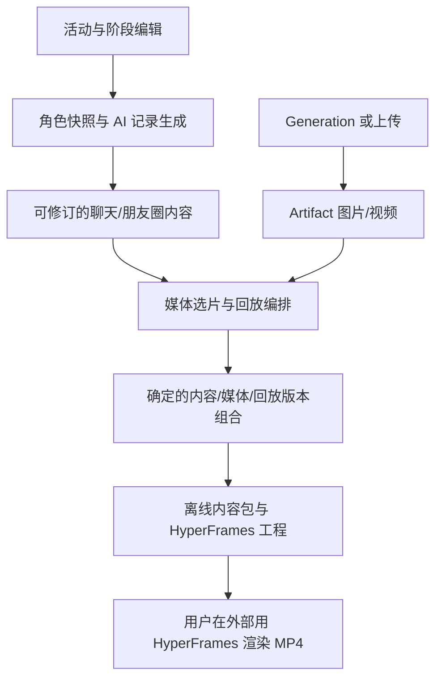

# 活动工作室：独立应用开发规格与模型交接计划

文档版本：1.0  
用途：交给具备当前仓库访问能力的开发模型直接实施。  
当前状态：需求与实施规格；功能尚未实现，HyperFrames 样片尚未验证。  
优先级：本文汇总并取代此前两份讨论稿的实施口径。用户后续明确指令优先于本文。

## 0. 给接手开发模型的说明

请建设一个完整的“活动聊天内容创作与回放应用”，而不是只写方案、静态页面、演示 JSON 或一次性视频。

在 SthStart 现有仓库内新增独立应用，复用角色库、公共模型配置、Generation 和 Artifact；不以邻舍启动为前提，不修改 `upstream/linshe`。这里的“独立”是业务和运行依赖独立于邻舍，不是要求另建无关仓库或重写基础设施。

用户最终需要：一场独立活动的群聊、朋友圈、图片和视频，以及可以交给 HyperFrames 在外部渲染的工程。成片表现为模拟手机/平板查看聊天和朋友圈：滚动文字、展开图片、播放消息内视频、返回并切换页面。

用户已经明确选择：**应用导出可渲染的 HyperFrames 工程，用户在外部生成 MP4。第一版不建设应用内一键 MP4 渲染服务。** 开发时仍必须真实渲染测试工程，证明导出成立。

实施顺序：读仓库规则与本文 → 建立现有验证基线 → 先做一个真实可渲染样片 → 固定数据契约 → 活动与编辑 → 版本与媒体 → 回放与导出 → 整体验收。

不要把临时样片当成最终交付。不要删除回溯、完整媒体打包、工程导出这些用户已要求的能力来缩小任务。常规实现细节按本文建议自主决定；只有影响已确认需求或无法跨过的外部依赖才需要重新询问用户。

本文中标注“必须”的内容是验收要求；标注“建议默认”的数值与内部实现可在有证据的情况下调整，并记录原因。列出的代码路径是当前仓库观察结果，开工时先核对，不能凭文档假设文件未变化。

## 1. 已确认需求、默认选择与非目标

### 1.1 必须实现的需求

| 编号 | 需求 | 可观察的完成结果 |
| --- | --- | --- |
| R01 | 每个活动独立 | 相同角色参加两场活动，记录、事实、草稿、任务和采用版本互不串用 |
| R02 | 活动设定 | 标题、活动类型、主题、人物、地点和活动规则可编辑 |
| R03 | 阶段管理 | 至少两个阶段；支持增加、删除、改名、复制、排序，内容可留空 |
| R04 | 人设驱动 | 选择角色后固定人设快照；生成内容使用人物身份、关系和说话习惯 |
| R05 | AI 自主与指定 | 可完全自主安排阶段，也可补充指定阶段细节；锁定安排不会被覆盖 |
| R06 | AI 预览 | 有方案预览、详细文字预览；支持编辑、重做与采用 |
| R07 | 群聊记录 | 头像、姓名、文字、图片、视频、时间顺序、可编辑的记录 |
| R08 | 朋友圈记录 | 帖子、作者、配图/视频、评论、点赞记录，与本场事实一致 |
| R09 | 媒体 | 支持生成或上传图片；支持视频上传和按真实能力接入视频生成 |
| R10 | 回溯 | 内容和媒体保留旧版，可重做局部/阶段，切回旧版并继续 |
| R11 | 模拟设备回放 | 滚动、停留、展开图片、播放视频、关闭返回、切换朋友圈 |
| R12 | 回放可编辑 | 调整观看顺序、速度、媒体展开、设备与观看身份，无须重写剧情 |
| R13 | 完整打包 | 全部采用记录和真实媒体文件可离线保存，不只是 URL 或截图 |
| R14 | HyperFrames 工程 | 导出实际 HTML composition、动画与素材，解压后可以渲染 |
| R15 | 稳定性 | 刷新/重启不丢已采用内容；旧任务迟到不覆盖新版本 |

### 1.2 为减少反复澄清而采用的默认值

- 产品暂名“活动工作室”，内部 ID `activities`，入口 `/apps/activities`。
- 用户主要作为创作者编辑记录；可以手动添加自己的发言。实时长期陪伴不作为第一版前提。
- 默认先预览整场方案，再按阶段生成详细记录；提供整场文字生成批次，仍逐阶段保存结果。
- 第一套模板为通用手机聊天/动态界面；默认竖屏，后续补平板布局。接口与回放数据从开始就不硬编码单一尺寸。
- 第一版优先完成群聊和朋友圈。私聊可复用会话结构，先保留数据能力，独立私聊交互可后续补充。
- 除用户已要求的完整导出，建议第一版增加项目再导入，保证保存后能继续编辑。
- 多种主题皮肤、复杂分支树和通用剪辑器不进入第一版。
- 开发验收使用原创测试角色；不要为测试依赖网络抓取原神资料。

这些默认值不是已经获得的额外用户偏好；若用户后来修改，按用户指令更新。

### 1.3 明确不做

- 不修改邻舍数据库、群聊引擎、朋友圈、启动流程或子模块指针。
- 不要求邻舍安装完成、在线或具备某个定制接口。
- 不建设角色后台日程、真实世界时钟、跨活动好感度、长期生活模拟。
- 不把活动经历自动写回公共人设或邻舍记忆。
- 不建设应用内视频渲染进程调度、云渲染计费或常驻 HyperFrames 服务。
- 不把用户或 AI 输入的任意 HTML 当作可执行模板。
- 不重写现有 Generation、Artifact、角色库或管理认证。
- 不用浏览器真实录屏/真实点击作为唯一视频生产路径。

## 2. 核心架构与数据归属



必须分开三个层次：

1. **内容**：谁说了什么、谁发了什么动态、阶段中发生了什么。
2. **媒体**：记录引用的照片、视频、头像和声音文件，以及采用哪一个候选。
3. **回放**：观众从哪个人的设备视角、按什么顺序和速度看到内容。

改变第三层不能触发第一层重新生成。改变一张选片不应重做整场活动。完整记录的范围大于等于成片展示的范围，未被剪入视频的采用记录仍进入完整内容包。

公共角色资料属于共享静态源；每场活动持有人设快照。活动事实与摘要只用于该活动的有效内容版本。媒体字节可以复用，但每个活动/版本必须有自己的归属关联和保留引用。

## 3. 仓库接入地图与已发现约束

当前基础：React 19、TypeScript、Vinext/Next 路由、TanStack Query、TypeBox、Fastify、Node SQLite、npm workspaces。沿用现有栈，不因为新应用另引入前端框架或 ORM。

| 路径 | 当前作用 | 本次工作 |
| --- | --- | --- |
| `app/page.tsx`、现有应用卡片 | 门户入口 | 增加活动入口，不重做门户 |
| `app/api/admin/[...path]/route.ts` | 会话、CSRF、管理接口代理 | 核对并补齐视频/ZIP 流式上传、HEAD 等必要能力 |
| `app/lib/api-client.ts` | 认证请求、响应 schema 校验 | 复用；新 API 传 schema |
| `app/lib/query-keys.ts` | Query 缓存键 | 增加按 activity/revision 区分的 keys |
| `app/features/characters/` | 角色选择与编辑基础 | 复用数据接口/可组合组件 |
| `app/features/creative/` | 媒体任务与画廊 UI | 复用交互模式，避免绑定到错误 appId |
| `packages/contracts/src/index.ts` | TypeBox、共享类型、人设结构 | 从新 `activities.ts` 导出契约，避免继续塞大文件 |
| `apps/service/src/server.ts` | app 注册、路由、后台生命周期 | 注册活动消费者、路由和自己的任务恢复 |
| `apps/service/src/database.ts` | 公共 SQLite 迁移 | 追加活动表；禁止改写已经发布的历史迁移 |
| `apps/service/src/characters.ts` | 结构化人设、发布版本 | 读取快照，不绕过角色发布/资料边界 |
| `apps/service/src/generation/` | 通用媒体执行 | 用现有入口建任务，不复制引擎实现 |
| `apps/service/src/artifacts.ts` | 流式媒体、访问和保留 | 上传、读取、引用保护、完整打包 |
| `apps/service/src/providers.ts` | 公共模型解析等 | 阅读真实接口，再接活动身份的 LLM |
| `scripts/linshe-doctor.mjs` | 数据库版本诊断 | 若新增公共迁移，同步硬编码目标数量或最小化消除重复常量 |
| `playwright.config.ts`、`tests/e2e/` | 浏览器测试 | 新增活动测试，使用独立测试端口和数据目录 |

开工必须核对以下实际限制：

1. `generation_context_links.context_type` 当前 CHECK 只允许 `character/narrative`。建议新增活动专属的媒体任务关联表，减少 SQLite 重建公共表的风险；不要把活动伪装成 narrative。
2. `generation/consumers.ts` 当前没有 `activities`。新增消费者、储存策略和 LLM/媒体用途分配；不要使用 `linshe` 或 `creative-center` 身份偷跑任务。
3. 管理 BFF 当前仅对 `image/*` 和 `application/octet-stream` 透传请求流，其他 body 会执行 `request.text()`。直接传 `video/mp4` 会有损坏风险。扩大经过验证的二进制类型匹配，覆盖视频、音频及工程 ZIP；测试实际字节一致性。
4. 管理 BFF 当前只导出 GET/POST/PUT/DELETE。本文 API 优先使用这些方法；媒体 HEAD 必要时添加并测试。CAS 使用 JSON 内 expectedVersion，无须依赖当前未透传的 If-Match。
5. 管理鉴权在现有管理路由注册逻辑中建立。确认新路由同样被覆盖，不能只因路径有 `/admin/` 就假定已鉴权。
6. 创作中心上传接口目前偏图片且有限额。复用底层流式函数，给活动定义自己的视频上传路由和上限，不直接复制图片限制。
7. 服务测试命令是 `node --test dist/*.test.js`，不会自动执行子目录所有测试。新模块的测试通过顶层 `activities*.test.ts` 入口纳入，或显式扩展脚本并验证覆盖。
8. 公共 LLM 分配目前以 `text/multimodal` 为角色类别。规划、对白、摘要先共享 `activities/text`，不要未经迁移强加 planner/writer 等新数据库枚举。
9. 现有数据库备份不等于完整媒体打包。不得把 backup 命令包装为本需求的工程导出。
10. 项目现有 autoStart 配置可能启动邻舍。独立活动不主动启动邻舍；独立性测试关闭已有自动启动配置，而非修改用户现有运行偏好。

建议目录：

```text
app/apps/activities/page.tsx
app/apps/activities/new/page.tsx
app/apps/activities/[id]/page.tsx
app/features/activities/
  api.ts, queries.ts, mutations.ts, keys.ts
  components/                 # 活动、阶段、记录、媒体、回放、历史、导出
  hooks/                      # 自动保存、生成任务、预览
apps/service/src/activities/
  routes.ts, store.ts, revisions.ts, validation.ts
  characters.ts, context.ts, prompts.ts, text-jobs.ts
  media.ts, media-links.ts, playback.ts
  exports.ts, imports.ts, archive.ts, events.ts
packages/contracts/src/activities.ts
packages/activity-playback/
  src/types.ts, normalize.ts, state-at-time.ts, layout.ts
  src/compile-hyperframes.ts, assets.ts
  templates/phone-v1/          # 受控 HTML/CSS/动画模板
  fixtures/                   # 固定原创记录和可分发小媒体
tests/e2e/activities.spec.ts
docs/development/logs/<日期>-activity-studio.md
```

新 package 的 exports、构建顺序、服务的 Node ESM 运行方式必须真实验证；现有源码导出模式不等于任何新增包都可以跳过构建。避免导入浏览器依赖到服务端。

## 4. 产品页面与交互规格

### 4.1 活动列表

显示封面、名称、类型、角色头像、阶段进度、最近更新时间和生成状态。支持创建、搜索、复制、归档、删除；第一版不需要协作权限系统。

复制默认只复制设定与角色快照，生成新 ID；可选复制采用内容与媒体引用，但不复制运行中任务。不把历史记忆无声带入新活动。

删除活动是显式操作，可先归档。删除后释放该活动引用，不直接删除仍被其他活动/版本引用的媒体。

### 4.2 创建与设定

字段：标题、类型（枚举建议+自由输入）、主题描述、时间/地点、氛围、原作约束/自由改编、角色、角色职责、观看身份、可选媒体偏好。

角色选择支持搜索现有角色库。空库时引导创建/导入角色；不假装已经自带大量原神人设。允许无头像，显示稳定占位头像。

保存选择时取人物资料版本、关系和外观快照。已发布版本优先；用户选择未发布草稿时，明确“以当前草稿建立本场快照”，内容必须随活动保存。

角色在活动内拥有独立 actorId，sourceCharacterId 只用于追溯。允许编辑本场服装与职责，不修改公共角色源。

### 4.3 阶段编辑

初始两张空白阶段卡。字段：标题、参与角色（默认继承活动）、地点（可继承）、描述、必须发生的行动、禁止改变的约束、结束条件、可选镜头需求。

主要操作：新增、改名、复制、拖动排序、删除、锁定。显示序号按当前顺序计算，stable stageId 不随排序变化。

- 草稿可暂时空白；采用方案时必须至少两个有效阶段。
- 删除到少于两阶段时阻止正式提交并说明原因；不要用假阶段凑数。
- 完全自主时 AI 可以替换未锁定占位阶段、建议阶段数量，预览后采用。
- 混合模式只补空白和细节；锁定内容与阶段顺序不能静默修改。
- 锁定阶段中有事实冲突时指出具体字段，提供候选修正，不直接覆盖。
- 删除/重排已经生成的阶段：保留旧版本，新版本标识后续内容需复核。

### 4.4 预览与记录编辑

采用“设定 / 记录 / 媒体 / 回放与导出”四个工作区。左侧阶段导航，主要内容区提供群聊与朋友圈切换；移动端以页签和抽屉替代固定三栏。

方案预览包含阶段概述、人物行动、示例对白、动态构想和镜头需求。详细预览包含实际群消息、帖子和评论。两者明确标识，避免用户把示例误当正式记录。

支持直接编辑、插入、删除、调整消息顺序、选择说话角色、回复引用、插入图片/视频槽位。帖子支持多图、视频及评论；第一版不需要复杂转发网络。

AI 候选保持在“候选预览”中。用户点击采用后才成为当前内容，不能自动混入角色摘要。完整文字已经采用时不因切换到回放页而再随机生成。

重写入口附可选原因：“不符合人设”“太长”“增加互动”“按我的描述修改”；原因进入本次请求，不变成全局角色规则。

消息纯文本按换行渲染，不默认允许任意 HTML。中文、emoji、长 URL、连续长词都不得撑破气泡。图片以缩略图展示，视频有封面、时长和播放图标。

### 4.5 媒体工作区

按阶段与镜头列出计划、候选、采用状态、生成进度和错误。可先使用占位卡，再上传或生成。

支持参考图、提示词、可用画幅和数量配置；字段来自已绑定工作流能力。未就绪时明确显示配置入口，文字创作仍可继续。

候选选择、重拍和视频素材裁切分别保存。裁切用于回放，原素材保留。

### 4.6 回放与导出工作区

选择固定观看身份、手机模板、播放模式、默认阅读速度；查看可播放的模拟界面预览。

回放通过片段列表编辑：拖动顺序、停留时长、是否展开媒体、视频取哪一段、转到哪个帖子。提供自动编排与恢复默认；第一版不建设通用多轨剪辑器。

拖动进度条必须得到正确画面；预览不能依赖从头执行真实点击。编译失败、媒体缺失、失效引用要定位到具体片段。

完整内容包、HyperFrames 工程包、包含历史是清晰的导出选项。原始记录全部保留与视频选取片段分开设置。

### 4.7 保存和冲突

草稿建议 700ms 去抖自动保存，显示“保存中/已保存/保存失败”。页面切换不能丢弃未确认保存的修改。

请求带 expectedVersion，服务端 CAS。旧响应到达时不能覆盖更新的本地编辑。409 时保留本地草稿，提供查看服务器版本和另存候选；禁止 last-write-wins 静默覆盖。

第一版可保留浏览器本地应急草稿，但完整离线同步不是必须；不要复刻整个 Notebook 同步系统。

## 5. 数据模型：明确且尽量少的版本机制

### 5.1 建议采用的第一版方案

采用**不可变 JSON 内容快照 + 独立媒体选择快照 + 独立回放快照 + 当前指针**。避免第一版建设通用事件溯源平台、复杂图数据库或散落在多表中的难以恢复的可变状态。

完整内容快照只含文字、配置和引用，不含媒体 base64。阶段与内容有稳定 ID；新快照允许复用未变化的 ID。通过 parentRevisionId 表示从哪里修改，无须前端展示复杂分支树。

量级较大后可以把阶段内容拆成独立不可变块并去重，但外部 schema、版本和恢复语义不变。第一版给出文档大小上限，超限明确报错，禁止静默截断。

### 5.2 概念实体

| 实体 | 必须包含 | 规则 |
| --- | --- | --- |
| Activity | id、标题、归档状态、headVersion、当前内容/媒体/回放指针、时间 | headVersion 用于原子修改当前采用组合 |
| Draft | activityId、draftVersion、document、baseContentRevisionId | 自动保存的可变草稿，与采用版分开 |
| ContentRevision | id、activityId、parentId、document、schemaVersion、hash、创建来源 | 不可变；包含设定、人设快照、阶段和记录 |
| Candidate | id、activityId、baseRevisionId/draftVersion、scope、payload、校验报告 | 生成/手改的候选，不自动进入上下文 |
| MediaRevision | id、activityId、contentRevisionId、slotBindings、hash | 每个槽位绑定一个或多个实际媒体候选 |
| PlaybackRevision | id、activityId、contentRevisionId、mediaRevisionId、document、hash | 明确依赖内容和媒体版本 |
| Checkpoint | id、activityId、名称、三类版本指针、创建时间 | 保存一个可恢复的采用组合；回放可为空 |
| ActivityAsset | activityId、assetKey、artifactId、来源、类型、尺寸/时长、hash | 活动内访问和跨活动显式复用的边界 |
| TextJob | id、activityId、目标版本、请求hash、状态、结果候选ID、模型元数据 | 独立于媒体 Generation 任务 |
| MediaJobLink | activityId、contentRevisionId、slotId、slotFingerprint、generationTaskId | 防止晚到结果污染当前版 |
| JobEvent | 单调id、jobId、activityId、type、payload | 可重连；不得泄漏完整敏感上下文 |
| Export/ImportJob | 固定版本组合、范围、状态、文件与校验报告 | 可复用活动任务表的 kind 字段 |

建议表名统一 `activity_` 前缀；具体 SQL 根据现有迁移风格实现。关键唯一约束：任务幂等键在 activity+operation 范围唯一；同一 activity 的 assetKey 唯一；快照/任务归属不能跨活动引用。

外键与服务校验同时保证 revision 属于目标 activity。不要只做前端过滤。列表与状态索引至少覆盖 activityId、updatedAt、job.status、parentRevisionId。

### 5.3 三个时间与稳定引用

- `createdAt`：系统何时生成/编辑，真实 ISO 时间。
- `storyOrder`、`storyTimeLabel`：剧情顺序和可选显示时间，不依赖真实日期。
- `atMs/durationMs`：视频播放时间，整数毫秒。

排序以明确字段为准，不用随机 ID 或文件时间推断。所有示例 ID 都是应用数据标识，不是数据库数组位置。

### 5.4 内容契约示意（实施时补 TypeBox 验证）

以下是字段级规格，不是可直接复制运行的完整库。CharacterDraft 复用公共契约；JSON 导出必须有 schemaVersion。

```ts
type Id = string;
type ReviewState = 'ready' | 'needs_review';
type GenerationMode = 'autonomous' | 'fill_details' | 'strict';

interface ActorSnapshot {
  id: Id;                         // 活动内角色 ID
  sourceCharacterId?: Id;
  sourceVersion?: number;
  displayName: string;
  persona: CharacterDraft;        // 复用现有结构化人设
  avatarAssetKey?: Id;
  activityRole: string;
  outfitDescription: string;
  appearanceReferenceAssetKeys: Id[];
}

interface StageDefinition {
  id: Id;
  title: string;
  order: number;
  actorIds: Id[];
  location: string;
  instruction: string;
  requiredBeats: { id: Id; text: string; actorIds: Id[] }[];
  locked: boolean;
  endCondition: string;
}

interface Conversation {
  id: Id;
  kind: 'group' | 'direct';
  title: string;
  memberActorIds: Id[];
}

interface MediaSlot {
  id: Id;
  stageId: Id;
  kind: 'image' | 'video';
  caption: string;
  shotDescription: string;
  actorIds: Id[];
  sourceFactIds: Id[];
}

interface ChatMessage {
  id: Id;
  conversationId: Id;
  stageId: Id;
  kind: 'message' | 'system';
  speakerActorId?: Id;            // message 必须；system 不伪造角色
  text: string;
  mediaSlotIds: Id[];
  replyToMessageId?: Id;
  storyOrder: number;
  storyTimeLabel?: string;
}

interface MomentPost {
  id: Id;
  stageId: Id;
  authorActorId: Id;
  text: string;
  mediaSlotIds: Id[];
  storyOrder: number;
  storyTimeLabel?: string;
  sourceFactIds: Id[];
}

interface MomentComment {
  id: Id;
  postId: Id;
  authorActorId: Id;
  text: string;
  replyToCommentId?: Id;
  storyOrder: number;
}

interface ActivityFact {
  id: Id;
  stageId: Id;
  text: string;
  sourceRecordIds: Id[];
  knownByActorIds: Id[];
  status: 'planned' | 'happened';
}

interface StageResult {
  stageId: Id;
  sourceContextHash: string;
  reviewState: ReviewState;
  summary: string;
  factIds: Id[];
}

interface ContentDocument {
  schemaVersion: 1;
  activity: {
    title: string; type: string; theme: string;
    location: string; rules: string;
    generationMode: GenerationMode;
  };
  actors: ActorSnapshot[];
  relationships: { fromActorId: Id; toActorId: Id; description: string }[];
  stages: StageDefinition[];
  conversations: Conversation[];
  messages: ChatMessage[];
  posts: MomentPost[];
  comments: MomentComment[];
  likes: { postId: Id; actorId: Id }[];
  mediaSlots: MediaSlot[];
  facts: ActivityFact[];
  stageResults: StageResult[];
}
```

必须补齐的关系校验：演员/阶段/会话引用有效；群消息说话者属于该会话；回复不引用未来消息或形成环；帖子与评论存在；媒体槽类型与资产类型匹配；ID 唯一；正文或媒体至少一项非空；阶段结果只引用该版本中存在的事实。

建议默认容量为可配置值：单活动 20 个角色、50 阶段、5000 条记录、20 MiB 内容 JSON。它们是避免失控的初始保护值，M0/M5 应按测试结果调整；界面不得把这些值宣传为用户已经要求的限制。

当前Fastify默认bodyLimit为12MiB，若采用20MiB内容上限，需要为相关活动JSON路由单独设置匹配限制并测试BFF，不能仅在schema中声明更大值，也不要无条件扩大所有接口上限。

MediaRevision.slotBindings 建议使用 `{slotId, slotFingerprint, assets: [{assetKey, order}]}`；空绑定表示计划槽位尚未选片，不等于丢失文件。素材缺失指已经绑定的assetKey对应文件不存在，两类状态应分别提示。

## 6. 版本、采用和回溯算法

### 6.1 当前组合与恢复点

当前采用状态记为：

```ts
interface AdoptedHead {
  activityId: string;
  headVersion: number;             // 每次原子修改递增，不能倒退
  contentRevisionId: string;
  mediaRevisionId: string;
  playbackRevisionId: string | null;
}
```

其中 MediaRevision 必须绑定同一 contentRevisionId；PlaybackRevision 必须绑定这两者。不能自由组合互不兼容的三份快照。

Checkpoint 保存采用组合和标签。恢复时 headVersion 仍递增，指针可指向旧 revision。这样一个旧客户端不能因“恢复到了旧版本号”重新写入。

### 6.2 采用候选的原子流程

1. 检查 activity、candidate 归属、expectedHeadVersion、候选基于哪个内容版本/草稿版本。
2. 完整校验候选结构、引用、锁定要求与影响范围。
3. 生成新 ContentDocument；只合并请求授权的 scope，不用整份 LLM 响应覆盖未改内容。
4. 保留未变化消息的 ID；新消息由服务端生成 ID。把 AI 临时 ID 及所有内部引用统一重映射。
5. 标记受影响的后续 StageResult 为 needs_review；不静默宣称其仍然符合新前文。
6. 根据新内容的 mediaSlotId + slotFingerprint 迁移仍兼容的媒体绑定；语义变化的镜头不沿用旧选片为“已确认”。
7. 创建不可变 ContentRevision 和兼容 MediaRevision；旧 PlaybackRevision 保留在历史，新 head 的 playbackRevisionId 置空或创建经验证的新草稿，不继续指向旧内容。
8. 在同一个 SQLite 事务中写入快照、引用元数据、Checkpoint 并 CAS 更新 head。
9. 文件/网络操作不得放进长 SQLite 事务；失败不留下可见的半采用状态。

当 expectedVersion 不符，返回 409，把候选留给用户。第一版不做自动三方语义合并；可提供“基于当前版重新生成/另存候选”，不能无声覆盖。

### 6.3 单项修改规则

| 修改 | 必须处理 | 不应触发 |
| --- | --- | --- |
| 文字润色 | 新内容版、布局和时间校验；用户声明事实未变仍保留来源 | 整场重生成 |
| 改角色行动或结果 | 新事实、后续阶段需复核、相关镜头/帖子需更新 | 覆盖旧分支 |
| 新增/删/重排阶段 | 稳定 ID、两阶段约束、从受影响位置检查依赖 | 删除历史媒体 |
| 图片选片 | 新 MediaRevision；回放重新绑定/验证 | LLM 对白重生成 |
| 修改滚动或停留 | 新 PlaybackRevision | 内容、媒体模型请求 |
| 恢复 Checkpoint | 原子切换三类指针；headVersion 递增 | 借助 AI 猜测旧内容 |

阶段重做第一版从完整阶段边界开始即可；逐条编辑是必须，任意消息位置自动分支续写可后续增强。不要把“支持逐条编辑”误实现为“只能重做整场”。

### 6.4 事实依赖与历史清理

上下文只读取目标 ContentRevision 中已采用且 ready 的前序阶段。摘要保存 sourceContextHash，不能用另一个版本的摘要。

早期事实改变时，后续默认需复核。用户可以比较、手改或重新生成；若选择保留后续内容，显式创建新的确认状态并校验引用。系统不能凭模型自评承诺完全理解所有语义依赖。

共享媒体只在最后一个有效引用释放后允许清理。归档不释放记录。第一版可不开放单条历史物理清理，但不得自动删除旧版来节省实现工作。

## 7. 后端接口规格

浏览器通过 `/api/admin/activities...` BFF 请求；服务实际路径为 `/api/v1/admin/activities...`。下表使用服务端基础路径简写 `/activities`。返回类型全部建立 TypeBox schema，浏览器验证关键响应。

### 7.1 活动、草稿与版本

| 方法与路径 | 请求/结果 | 行为 |
| --- | --- | --- |
| GET `/activities` | q、archived、cursor、limit → items,nextCursor | 稳定排序，限制单页数量 |
| POST `/activities` | 初始标题、角色选择、类型 → activity,draft,head | 创建两个空阶段和空内容基线 |
| GET `/activities/:id` | → activity,draftVersion,head,summary | 不一次返回所有历史媒体 |
| PUT `/activities/:id` | expectedHeadVersion、标题/归档等 | CAS 更新元信息 |
| POST `/activities/:id/duplicate` | scope=settings/adopted | 新活动 ID，无运行任务 |
| DELETE `/activities/:id` | 明确删除操作 | 删除归属、释放引用，不碰其他活动 |
| GET `/activities/:id/draft` | → draftVersion,document,baseContentRevisionId | 编辑器恢复 |
| PUT `/activities/:id/draft` | expectedDraftVersion,document | 自动保存；不修改采用内容 |
| POST `/activities/:id/draft/commit` | expectedHeadVersion,expectedDraftVersion | 校验后生成内容新版 |
| GET `/activities/:id/content/:revisionId` | → ContentRevision | 校验归属 |
| GET `/activities/:id/history` | cursor → checkpoints,nextCursor | 历史可分页 |
| POST `/activities/:id/restore` | checkpointId,expectedHeadVersion | 恢复组合，生成新的 headVersion |
| POST `/activities/:id/candidates/:candidateId/adopt` | expectedHeadVersion | 原子采用候选 |
| GET `/activities/:id/candidates/:candidateId` | → candidate,validation | 可以比较、不自动采用 |

初始空基线允许少于生成完成条件，但正式方案采用/详细生成要至少两阶段。不要因创建基线而跳过“完成活动”的验收。

### 7.2 文本生成与进度

| 方法与路径 | 主要字段 | 行为 |
| --- | --- | --- |
| GET `/activities/capabilities` | → llm、媒体用途、模板与限制状态 | 不依赖邻舍 health |
| POST `/activities/:id/generation-jobs` | mode、scope、baseRevisionId/expectedDraftVersion、instructions | 202 返回 job；不会等整场生成完才响应 |
| GET `/activities/:id/jobs` | status、cursor | 任务列表 |
| GET `/activities/:id/jobs/:jobId` | → job,resultCandidateIds | 刷新后恢复 |
| POST `/activities/:id/jobs/:jobId/cancel` | 原任务ID | 尝试取消，准确报告范围 |
| POST `/activities/:id/jobs/:jobId/retry` | 新幂等键、明确重试 | 新任务关联 retryOf |
| GET `/activities/:id/events` | Last-Event-ID | 持久事件回放；可降级轮询 |

mode 建议：`plan`、`stage`、`rewrite-records`、`whole-text`。scope 结构化指定 stageId/recordIds，不允许任意数据库条件或原始 prompt 覆盖系统指令。

### 7.3 媒体、回放与工程

| 方法与路径 | 请求/结果 | 行为 |
| --- | --- | --- |
| POST `/activities/:id/uploads` | binary、文件名header | 流式上传，返回 ActivityAsset |
| POST `/activities/:id/assets/link` | 来源 artifactId | 明确选择已有素材；校验授权再建立归属 |
| GET/HEAD `/activities/:id/assets/:assetKey` | Range/ETag | 真正流式读取，支持视频拖动 |
| POST `/activities/:id/media-jobs` | contentRevisionId,slotId,slotFingerprint,parameters | 复用 Generation |
| POST `/activities/:id/media-selection` | expectedHeadVersion,slotId,assetKeys | 新媒体选择版本 |
| GET `/activities/:id/media/:mediaRevisionId` | → bindings | 与内容版本关联 |
| POST `/activities/:id/playback/auto` | contentRevisionId,mediaRevisionId,options | 确定性编排候选，不调用 LLM 也可工作 |
| PUT `/activities/:id/playback` | expectedHeadVersion,document | 验证后保存新回放版 |
| POST `/activities/:id/previews` | 回放版本或明确的草稿快照 | 建立受控预览工程，返回预览位置 |
| POST `/activities/:id/exports` | 固定revision组合、format、history范围 | 202 异步生成 ZIP |
| GET `/activities/:id/exports/:jobId/download` | → ZIP stream | 校验归属，正确 Content-Disposition |
| POST `/activities/imports` | ZIP stream | 导入暂存、校验，返回预览job |
| POST `/activities/imports/:jobId/commit` | 校验通过的导入job | 新 ID 重映射，创建新活动 |

导出 format：`reader`、`project`、`hyperframes-project`。hyperframes-project 必须包含当前完整记录、实际媒体、离线阅读和可渲染工程；是否带旧历史另选。

### 7.4 错误与幂等

成功创建任务返回 202，结构化错误返回 `error/message/requestId`，必要时带 `details`。建议错误代码：

`activity_not_found`、`revision_conflict`、`revision_scope_mismatch`、`stage_count_invalid`、`locked_constraint_conflict`、`candidate_invalid`、`llm_not_configured`、`generation_result_unknown`、`media_missing`、`media_not_authorized`、`slot_changed`、`playback_target_missing`、`playback_timing_invalid`、`template_not_ready`、`export_incomplete`、`import_invalid`、`quota_exceeded`。

模型/工作流未配置一般返回 409 或 503 并给出配置入口；不能伪造内容成功。授权失败不能转化为离线重试。

创建成本型任务必须使用 Idempotency-Key。持久化 `(activityId,operation,key,requestHash)`；同key同请求返回原job，不重复调用；同key不同请求返回409。不同重做必须使用新key。

## 8. 文本任务与服务恢复

文本任务状态建议：`queued → running → succeeded | failed | cancelled | result_unknown`。成功仅表示已产生可用候选，不表示用户采用。媒体任务继续使用 Generation 原有状态，不强行改公共枚举。

流程：先写任务意图和上下文版本 → 后台执行 → 校验结果 → 写候选 → 记录持久事件。活动执行器按阶段串行；不同活动可共享有界并发，默认文本并发2，可配置。

对有外部任务ID的媒体，恢复时先查询现有任务。普通 LLM 请求在进程崩溃后未必可查；标 result_unknown 并允许用户明确重试，不能宣称所有供应商都能保证恰好执行一次。

Whole-text 是父批次串行调度阶段任务，每个成功阶段有独立候选/记录；取消剩余批次不能抹掉已成功部分。下阶段上下文使用用户采用版或本批次明确标记的暂定链，不把其他任意候选混入；整批未采用时不改正式 head。

执行器固定输入快照，记录模型 profileId、模型名、提示词版本、上下文hash、用量（供应商返回时）和目标范围。日志只存必要诊断，完整正文与prompt不默认打印。

SSE 使用单调事件ID，客户端先读取状态再订阅/补录；事件只是提示，数据库状态是最终依据。Query keys 必须包含 activityId、revisionId；组件卸载要清理订阅。

服务关闭时停止接新任务、有界等待正在落库的工作，保护 SQLite 生命周期。不把一次失败变成启动时无限重试。

## 9. AI 生成契约与提示词要求

### 9.1 上下文组装

输入只包括：本场人设快照与必要关系、活动主题、已采用前序事实、当前阶段要求、请求修改范围、用户指定风格。原始长记录按预算裁剪，保留来源ID和摘要；禁止跨活动检索。

第一版无需为每位角色运行长期代理。一次阶段生成可产出多角色交互；模型需要体现不同语气和立场，不能让每个角色用相同句式轮流复述主题。

计划中的惊喜不是已发生事实。角色能看到的信息以 knownByActorIds 限制；导演安排可以全知，但角色对白不能提前知道尚未揭晓内容。

优先复用 `activities/text` 公共模型配置。不要硬编码某一家模型，不把旧人设中的提示词当作系统开发指令；它是角色描写资料。

### 9.2 输出过程

规划输出阶段结构；详细输出记录和事实；镜头输出可生成素材描述。AI 不输出最终工程代码，不写数据库主键，不选择系统文件路径，不决定认证信息。

每种输出必须有严格 schema 和完整 JSON 示例。提示词说明各字段意义、长度约束、ID引用范围及禁止事项；不要只写“请输出 JSON”。

模型支持结构化输出时可以使用，但仍做服务端验证。无支持时仅允许清理外层 Markdown fence，解析失败保存错误报告；最多一次格式修复请求，不能自动无限重试。

### 9.3 规划输出示例

以下示例使用请求中的原创角色 actor_lan、actor_cheng。正式 prompt 要带入实际允许 ID 和字段约束。

```json
{
  "schemaVersion": 1,
  "overview": "两位朋友先布置海边营地，再在晚餐后交换祝福并合照。",
  "stages": [
    {
      "clientId": "plan_s1",
      "title": "布置营地",
      "actorIds": ["actor_lan", "actor_cheng"],
      "location": "海边营地",
      "description": "岚整理桌面，澄挂起灯串，两人讨论晚餐安排。",
      "requiredBeats": ["澄完成灯串布置"],
      "endCondition": "桌面和灯串布置完毕"
    },
    {
      "clientId": "plan_s2",
      "title": "晚餐与合照",
      "actorIds": ["actor_lan", "actor_cheng"],
      "location": "营地长桌",
      "description": "两人共进晚餐，交换祝福，拍摄合照并发布活动动态。",
      "requiredBeats": ["两人在灯串下合照"],
      "endCondition": "合照完成并互道晚安"
    }
  ]
}
```

混合/严格模式应回传请求已有的 stageId，保持锁定范围；新建阶段使用 clientId 再由服务端映射。schema 不允许模型凭空生成用户未选择的人物。

### 9.4 阶段详细输出示例

此示例是 AI 中间协议，不是最终 ContentDocument。clientId 在一次响应内唯一，采用时统一映射。

```json
{
  "schemaVersion": 1,
  "stageId": "stage_2",
  "summary": "晚餐后，岚与澄在灯串下完成合照，澄发布动态记录这一刻。",
  "messages": [
    {
      "clientId": "m1",
      "conversationId": "group_main",
      "speakerActorId": "actor_lan",
      "text": "灯光刚刚好，我们在这里拍张合照吧。",
      "mediaClientIds": [],
      "order": 10
    },
    {
      "clientId": "m2",
      "conversationId": "group_main",
      "speakerActorId": "actor_cheng",
      "text": "拍好了！这张我要留下来。",
      "mediaClientIds": ["photo1"],
      "order": 20
    }
  ],
  "posts": [
    {
      "clientId": "p1",
      "authorActorId": "actor_cheng",
      "text": "海风、灯串，还有今晚的合照。",
      "mediaClientIds": ["photo1"],
      "sourceFactClientIds": ["f1"],
      "order": 30
    }
  ],
  "comments": [
    {
      "clientId": "c1",
      "postClientId": "p1",
      "authorActorId": "actor_lan",
      "text": "下次再来。",
      "order": 40
    }
  ],
  "facts": [
    {
      "clientId": "f1",
      "text": "岚和澄已在灯串下完成合照。",
      "status": "happened",
      "sourceRecordClientIds": ["m1", "m2"],
      "knownByActorIds": ["actor_lan", "actor_cheng"]
    }
  ],
  "mediaSlots": [
    {
      "clientId": "photo1",
      "kind": "image",
      "caption": "灯串下的合照",
      "shotDescription": "两人站在营地长桌旁，灯串在上方，海面为远景；使用本场固定服装与人物参考。",
      "actorIds": ["actor_lan", "actor_cheng"],
      "sourceFactClientIds": ["f1"]
    }
  ],
  "requiredBeatCoverage": [
    { "beatId": "beat_group_photo", "recordClientIds": ["m1", "m2"] }
  ]
}
```

服务端验证 requiredBeatCoverage 引用存在，但不能仅凭模型声称覆盖就保证语义正确。锁定事实的冲突采用规则检查、可选辅助模型检查与用户预览结合。

### 9.5 提示词最低要求

- 明确这是本场活动创作，角色资料用于语气、身份和外观。
- 列出允许角色/会话/阶段 ID，只允许引用这些及响应内 clientId。
- 对话有回应关系，不让所有人机械依次发言；不要求每位角色每一轮都说话。
- 帖子必须基于已发生事实，评论时间在帖子之后；共享照片可复用一个媒体槽。
- 不用对白代替全部动作，可通过系统记录或事实辅助，但最终呈现以聊天/动态为主。
- 指定输出条数与长度预算；超限/被截断的 JSON 不进入采用版。
- 不插入新的主角、改变锁定行动或泄露角色尚未知晓的惊喜。
- 只输出协议 JSON，不附解释或 HTML。

## 10. 媒体接入与引用保护

活动媒体生产通过现有 Generation API/内部函数。appId 为 activities；用途映射到可用 text-to-image、image-to-image、视频工作流，必须根据真实能力判断，不把占位标为生成成功。

头像、参考图来自其他 app 时走显式授权或受控复制并登记活动资产。Artifact 属于同一全局服务，不代表任意活动都可直接引用任意 ID。

slotFingerprint 至少包含角色外观快照、镜头描述、参考图、媒体类型和来源事实版本的规范化hash；用于检测“同一个 slotId 的语义已变”。

媒体任务完成：登记 ActivityAsset → 在提交时的版本范围保存候选 → 用户采用后创建新的 MediaRevision。即使任务完成时 head 已变化，也只能附到原版本候选列表。

使用 `createArtifactReference` 或相同受控机制保护：人设参考、采用媒体、历史媒体、导出中的媒体。不能只保护 generation task，任务删除后记录仍需要素材。

视频上传与导出走流，不使用整个文件的 Base64 或 arrayBuffer。建议默认单视频500 MiB、单图20 MiB，上限按工作流与全局剩余空间共同校验，并在能力接口中公开；这些默认值需要压力验证。

HEAD/Range/ETag、视频时长、封面和真实 MIME 都需处理。缺 ffprobe/ffmpeg 时原视频仍可保存，但不可凭空编造时长或承诺可裁切；回放可要求用户补充或在导出预检指出依赖。

## 11. 回放数据、自动编排与布局算法

### 11.1 播放脚本属于本应用

`playback.json` 是我们定义的领域协议，**不是 HyperFrames 已有的直接输入格式**。必须实现编译器，把它转为 composition、可定位时间的动画、媒体片段与固定素材路径。

回放必须包含：schemaVersion、内容/媒体版本、templateId/templateVersion、观看actorId、布局尺寸、输出尺寸/fps、播放模式、动作序列、总时长与可选音频设置。

建议内部布局使用逻辑像素，导出按固定倍数生成输出分辨率。手机初始建议逻辑360×640、输出1080×1920、30fps；这是可调整模板参数，不是设备规格承诺。平板预留独立逻辑布局，不能仅拉宽手机气泡。

观看身份默认是选定角色或显式创建的用户角色；决定左右气泡与用户名显示。没有隐含的“系统以用户身份说话”。

### 11.2 动作定义

| 动作 | 必需参数 | 语义 |
| --- | --- | --- |
| open_view | chat/moments、conversationId（聊天）、visibleThroughOrder | 设置视图与此时可见记录上界，避免泄漏后续阶段 |
| reveal_message | messageId | 实时模式显示该消息；必须满足会话和顺序 |
| typing | actorId、durationMs | 纯视觉提示，不产生新记录 |
| scroll_to | targetType、targetId、align、durationMs | 滚动到可见消息/帖子/评论 |
| hold | durationMs | 保持状态用于阅读 |
| open_media | slotId、assetKey、image/video、durationMs、sourceInMs（视频）、volume | 展开采用媒体；视频播放片段绑定此动作 |
| close_media | durationMs | 返回展开前视图和滚动位置 |
| stage_card | stageId、text、durationMs | 可选章节转场，不伪造角色发言 |
| reveal_comments | postId、throughOrder | 在当前帖子中展示可见评论 |

第一版主交互动作顺序执行，不允许互相矛盾的视图切换与媒体展开重叠。触点光圈、通知等装饰可以单独视觉轨，但不改变事实。

动作有明确 `atMs` 和 `durationMs`；时间范围使用半开区间 `[start,end)`，同一时间点的动作按确定序号执行。转换到帧时统一取整策略，不能不同模块各自 round/floor。

阅读历史模式可以一次显示该剧情时间点之前的记录，再滚动；模拟实时模式先设置较早的 visibleThroughOrder，再按 reveal_message 逐条显示。两种模式可按片段混合，不把所有历史都变成刚收到的消息。

### 11.3 完整回放示例

下面是一份独立固定样片数据，假定相应内容快照含 `message_photo`、`message_video`、`post_after` 等记录，并已有采用媒体。它不引用第9节示例的临时 clientId。

```json
{
  "schemaVersion": 1,
  "contentRevisionId": "content_sample_v1",
  "mediaRevisionId": "media_sample_v1",
  "template": { "id": "phone-chat", "version": "1.0.0" },
  "viewerActorId": "actor_lan",
  "layout": { "width": 360, "height": 640 },
  "output": { "width": 1080, "height": 1920, "fps": 30 },
  "totalDurationMs": 30000,
  "actions": [
    {
      "id": "a1", "type": "open_view", "atMs": 0, "durationMs": 7000,
      "view": "chat", "conversationId": "group_main", "visibleThroughOrder": 100
    },
    {
      "id": "a2", "type": "scroll_to", "atMs": 7000, "durationMs": 1000,
      "targetType": "message", "targetId": "message_photo", "align": "center"
    },
    {
      "id": "a3", "type": "open_media", "atMs": 8000, "durationMs": 4000,
      "slotId": "slot_photo", "assetKey": "asset_photo", "kind": "image"
    },
    { "id": "a4", "type": "close_media", "atMs": 12000, "durationMs": 400 },
    {
      "id": "a5", "type": "scroll_to", "atMs": 12400, "durationMs": 1000,
      "targetType": "message", "targetId": "message_video", "align": "center"
    },
    {
      "id": "a6", "type": "open_media", "atMs": 13400, "durationMs": 6000,
      "slotId": "slot_video", "assetKey": "asset_video", "kind": "video",
      "sourceInMs": 1000, "volume": 1
    },
    { "id": "a7", "type": "close_media", "atMs": 19400, "durationMs": 400 },
    {
      "id": "a8", "type": "open_view", "atMs": 19800, "durationMs": 1000,
      "view": "moments", "visibleThroughOrder": 150
    },
    {
      "id": "a9", "type": "scroll_to", "atMs": 20800, "durationMs": 1200,
      "targetType": "post", "targetId": "post_after", "align": "start"
    },
    { "id": "a10", "type": "hold", "atMs": 22000, "durationMs": 8000 }
  ]
}
```

open_media.durationMs 默认表示媒体展开并展示/播放的区间，close_media 描述返回动画。若要加展开动画，统一定义它属于该区间内部还是额外片段，模板与编辑器必须同口径；第一版推荐展开即进入展示，关闭单独计时。

open_view.durationMs 表示该操作的转场/初始阅读窗口，视图状态持续到下一次 open_view；动作结束不会把整个页面隐藏。hold 与 scroll_to 同样作用于持续状态。编译器应先求状态区间，再生成 HyperFrames clips，不直接把每个动作机械映射成会消失的视图。

### 11.4 自动编排建议算法

1. 根据用户选择的阶段、会话、帖子生成展示清单；记录仍全部保存在内容层。
2. 决定各片段的剧情上界，保证评论和媒体的来源已存在。
3. 为文字分配阅读时间。建议 `clamp(1200 + graphemeCount / 6 * 1000, 1800, 12000)` ms；标为可配置初值，长文可分段或用户加时，不能删字。
4. 实时模式加入可选 typing/reveal；历史模式先显示再滚动。
5. 优先使用消息/帖子锚点，计算 `scrollY = clamp(targetY - viewportAnchor,0,maxScroll)`。
6. 用户勾选需要展开的图片/视频；图片建议停留3秒起，视频时长来自素材并可裁切，不超出实际时长。
7. 按配置穿插朋友圈，保存返回聊天位置；不随机打乱故事顺序。
8. 插入用户选择的阶段转场；计算 totalDurationMs。
9. 运行引用、时间、媒体和布局预检，返回候选供预览。

此过程应为确定性函数，不需要再调用 LLM。可另提供 AI 推荐展示重点，但推荐也必须转换并验证为同一动作协议。

### 11.5 布局与时间可定位

核心函数建议为 `stateAtTime(playback, content, layout, t)`，同样输入和t产生同样视图、滚动位置、可见消息、弹窗和装饰状态。

消息高度必须在字体和媒体尺寸固定后测量；媒体预留真实宽高比，避免加载后跳动。中文与emoji换行按浏览器实际布局计算，不用字符数估算像素高度。

模板用固定视口与遮罩呈现滚动；动画优先对内容容器 transform 或经过验证的 scrollTop 定位。预览中可以支持真实滚动，但导出路径只能读取脚本状态。

编辑器可虚拟化长列表，导出不能依赖“用户滚到那里才加载”的逻辑。长项目可以按片段挂载必要记录，但任意时间跳转必须重建对应内容和位置。

第一帧、最后一帧、动作边界前后各一帧、后退跳转和跨视图跳转都要检查。

## 12. HyperFrames 编译与工程规范

### 12.1 使用边界

官方资料确认 HyperFrames 通过 HTML composition 描述时间轴，图片、视频、音频和子场景可进入组合；这是技术基础，不代表本项目聊天模板已经验证。[Compositions](https://hyperframes.heygen.com/concepts/compositions)

建议采用受控 HTML/CSS 模板与 GSAP 等可定位时间的动画。动画在暂停时间轴上注册，由框架控制播放位置；不要在动画回调中自由启动音视频。[GSAP 文档](https://hyperframes.heygen.com/guides/gsap-animation)

任何特定 CLI 参数、runtime 属性、player API、媒体裁切字段，都要以M0实际固定版本的官方文档和测试为准。本文定义的领域字段不能直接假设为 HyperFrames `data-*` 属性。

### 12.2 编译流水线

1. 冻结内容、媒体、回放三个revision及模板版本。
2. 校验引用与素材：真实文件存在、长度/hash一致、视频片段不越界、字幕/文本可渲染。
3. 生成规范化视图模型和状态区间；文本必须转义。
4. 固定字体、图片尺寸、设备逻辑尺寸，生成布局。
5. 从动作协议生成可定位时间的动画和框架媒体片段。
6. 把媒体、字体和合法可分发的运行资产放入工程，全部使用工程内相对路径。
7. 写入 index.html、composition、工程元数据、依赖版本与运行说明。
8. 开发/验收阶段执行 lint/check（该版本支持时）、关键帧截图和真实 render。

生产导出可以只编译与预检，不自动运行重型 MP4 渲染；正式验收必须真实渲染导出的包。这不等于在产品内开发渲染服务。

### 12.3 媒体片段与音频

视频展开时，根据 sourceInMs 与 durationMs 创建框架可控制的媒体片段。外框动画与视频播放分离，避免 `video.play()`、手动 currentTime 与框架冲突。[HTML schema](https://hyperframes.heygen.com/reference/html-schema)

同一视频在两处出现要有独立片段ID和各自偏移，不能复用一个未重置的DOM播放状态。缩略图使用静态封面；声音只在被选中的播放区间出现。

默认一次只播放一个有声视频。可选背景音乐需要配置音量和素材归属；复杂配音与音效混音不作为第一版前提。静音视频也必须正常展开和关闭。

### 12.4 预览与导出一致

优先让应用预览嵌入同一编译输出，避免React另画一套与导出不同的聊天界面。可以使用官方 Player，是否采用及实际 API 在M0固定。[Player](https://hyperframes.heygen.com/packages/player)

可执行脚本只来自受控模板；用户文字用textContent/正确转义，导入项目只读取结构化数据，不执行原包附带的HTML。预览 iframe 的消息通信校验来源、消息结构与预览ID，不接受任意命令。

预览字体、屏幕尺寸、模板版本和导出一致。预览的比例缩放不影响逻辑布局。显示“正在载入素材”和错误，不能在素材未就绪时导出空白截图。

### 12.5 必须验证的确定性

- 不使用 Date.now() 决定剧情/屏幕时间；不依赖自由运行 setTimeout。
- 所有随机装饰在编译时固定，不能逐帧随机。
- 渲染过程中不请求LLM或实时聊天数据。
- 同一输入在同一已固定环境下，连续播放与随机定位关键帧应一致；跨OS字体/编码差异需明确，不承诺任意环境的MP4字节完全相同。

相关机制以官方[确定性渲染说明](https://hyperframes.heygen.com/concepts/determinism)为参考，本项目另做实际关键帧验证。

## 13. 导出、离线阅读与再导入

### 13.1 包结构：选择一个自包含工程根

为了避免嵌套工程越过根目录查找素材，建议完整 HyperFrames 包以 ZIP 根作为渲染根：

```text
activity-export/
  index.html                     # HyperFrames 根 composition
  compositions/                  # 模板片段
  assets/
    media/                       # 所有采用原图/视频/头像/音频
    fonts/                       # 固定字体
    runtime/                     # 合法可分发且已固定的动画依赖
  data/
    manifest.json
    activity.json
    records.json
    media-selection.json
    playback.json
    history/                     # 用户选择时包含
  reader/
    index.html                   # 离线阅读，不依赖服务
    story.md
    conversations/
    moments/
  package.json                   # 已测试的精确依赖与脚本
  package-lock.json              # 或所选包管理器的同等锁文件
  README.md
  THIRD_PARTY_NOTICES.md
```

实际 HyperFrames 配置文件按固定版本生成，不编造未验证文件名。npm脚本使用工程内已固定依赖，不在最终README中让用户无条件下载latest。

普通阅读包可以去掉渲染依赖，只保留实际媒体与reader。项目包须能重新导入。不要把已生成的旧ZIP当成活动媒体再次递归打包。

### 13.2 Manifest 示例

下面示例省略了实际文件条目数量，实施时必须列出全部文件。sha256 使用真实计算值；不得把示例hash复制为正式值。

```json
{
  "schemaVersion": 1,
  "format": "activity-hyperframes-project",
  "exportId": "export_example",
  "sourceActivityId": "activity_example",
  "contentRevisionId": "content_example_v2",
  "mediaRevisionId": "media_example_v3",
  "playbackRevisionId": "playback_example_v1",
  "historyIncluded": false,
  "completeness": "complete",
  "toolchain": {
    "hyperframesVersion": "REPLACE_WITH_TESTED_EXACT_VERSION",
    "templateId": "phone-chat",
    "templateVersion": "1.0.0"
  },
  "files": [],
  "omissions": []
}
```

files 的每项包含相对path、byteSize、sha256、mediaType和逻辑assetKey（若为媒体）。manifest本身不要求包含自己的hash，避免循环定义。

正式 complete 包禁止空文件清单、占位版本、无法解析的资产路径和遗漏。`REPLACE_WITH_TESTED_EXACT_VERSION` 只允许出现在本规格示例，不允许进入实际导出。

### 13.3 快照、流式与失败语义

导出开始先冻结revision组合及文件清单，并临时保护引用。用户继续编辑不影响正在导出的快照。

读取实际字节、流式压缩、支持ZIP64。不要把500MiB视频全量读入Buffer。建议导出临时目录与最终ZIP分开，成功校验后原子发布；失败清理自身临时文件，不动源素材。

导出前报告：缺失媒体、未采用镜头、未完成任务、失效回放目标、视频片段越界、模板未验证。用户可以等待/修复，也可明确选择“不完整内容包”；不完整包标记partial并列出omissions，不能作为成功HyperFrames验收样本。

完整记录包括当前选择范围内未进入成片的聊天和动态。历史默认不含未采用的失败响应/调试prompt；用户明确选择历史时才带可用候选/旧版及所需媒体。

可渲染工程允许首次安装开发依赖需要网络；素材和内容不能依赖SthStart在线。README分别说明依赖准备与离线素材条件。普通reader应直接双击阅读，不依赖CDN或本地fetch JSON；数据嵌入或预渲染。

### 13.4 再导入

1. 上传ZIP进入受限暂存目录；检查相对路径、拒绝路径穿越/符号链接逃逸，限制解压大小、文件数和压缩炸弹。
2. 检查schema版本、manifest、hash、媒体类型与逻辑引用。
3. 展示标题、角色、阶段、记录数量、媒体数量和缺失项，不直接覆盖已有活动。
4. 提交后建立新activityId、actor/record/revision等ID映射，并同步重写所有引用。
5. 用Artifact受控上传/去重方式登记文件；采用状态和历史引用均可恢复。
6. 不自动恢复旧任务为running，不执行包内脚本，不导入密钥与机器路径。
7. 导入失败回滚本次新建实体和暂存内容，不能影响其他活动；允许用户重新选择包。

## 14. 基本访问、隐私与内容边界

沿用门户会话、CSRF和服务端管理令牌；密钥只留在公共服务。导出的HTML、JSON、README中不得包含API Key、Bearer Token、Cookie、机器绝对路径。

头像/图片URL进入工程前转换为实际文件与相对路径。不能把短期签名URL当永久素材，也不能把管理接口URL嵌入离线工程。

活动内人设可能含私密设定。提供“包含完整人设快照”的项目包与适合分享的阅读包区别；阅读包不额外展示完整角色秘密或内部prompt。

这些要求是导入/导出功能正确性的组成部分，不额外引入登录系统、权限平台或联网发布流程。

## 15. 分阶段实施任务与交付门槛

以下顺序具有依赖关系。无需一次性实现所有内部抽象；每阶段提交可检查的成果，并更新开发日志。最终交付为M0—M6闭环，不能在Mock阶段宣布完成。

### M0：仓库基线与真实样片（先解决最大未知）

任务：

- T00-01：读取当前AGENTS与项目约束，记录主仓库/submodule revision、git status，不覆盖用户已有修改。
- T00-02：运行相关现有验证，记录失败测试与新应用依赖，区分已有问题和本次回归。不为让CI变绿删除测试。
- T00-03：阅读官方HyperFrames文档，选择并固定实际版本，确认Node/FFmpeg/字体与浏览器依赖。不要直接照抄本文未验证的CLI细节。
- T00-04：制作固定原创记录：两个阶段、至少两位角色、一张图片、一段带可识别音轨的小视频、一个帖子和评论。
- T00-05：编写手机模板样片：聊天 → 滚动 → 图片展开返回 → 视频片段播放返回 → 朋友圈。
- T00-06：生成真正MP4；检查关键帧、音视频、前后跳转，留下输入fixture、版本、命令与结果说明。
- T00-07：确定预览嵌入、字体、布局测量与媒体裁切的实现，写一份短ADR。

门槛：真实样片可渲染；已知硬问题有具体定位。若外部环境暂缺依赖，继续可验证的接口与数据工作，报告渲染未验证；不得以截图代替MP4验收。

### M1：契约、迁移与活动骨架

任务：

- T01-01：新增TypeBox契约与业务引用校验，建立原创fixture。
- T01-02：追加活动表、约束和索引；支持新库与已有库升级，校验迁移幂等。
- T01-03：实现活动消费者与独立模型/媒体配置，注册入口和路由。
- T01-04：实现创建、列表、草稿、角色快照、两阶段编辑、排序和自动保存。
- T01-05：实现Content/Media/Playback revision及Checkpoint存取与CAS基础，尚无完整UI也必须能测试恢复。
- T01-06：补BFF二进制透传和必要HEAD；不得扩大修改到无关代理行为。

门槛：两个活动可以独立创建与编辑；同一角色源更新不会修改已建快照；冲突不会丢本地草稿；旧功能验证保持基线。

### M2：AI 规划、详细内容与编辑闭环

任务：

- T02-01：实现规划、阶段详细、局部重写的prompt和schema，带完整JSON示例。
- T02-02：实现持久文本job、幂等、重试、取消、未知结果和SSE/轮询。
- T02-03：实现全自主/混合/严格生成，锁定字段保护，临时ID映射。
- T02-04：实现方案/详细预览、记录编辑、群聊/朋友圈显示、采用候选。
- T02-05：实现whole-text串行批次与阶段级结果保留，不依赖长HTTP请求完成整场。
- T02-06：人物说话、帖子、评论、阶段事实和镜头引用一致；错误响应可定位。

门槛：至少完成生日会和旅行两种不同活动；锁定要求保留；不存在虚构“生成成功”的硬编码文本。确定性测试使用Mock，另有可配置真实LLM的人工验收记录。

### M3：回溯、媒体与任务恢复

任务：

- T03-01：实现版本历史、差异查看、阶段重做、Checkpoint恢复。
- T03-02：前序事实变化后标记后续需复核；上下文严格只用指定版本。
- T03-03：接入图片生成/参考图、视频上传和可用视频工作流；媒体槽与候选选择。
- T03-04：实现ActivityAsset、Artifact引用保护、跨来源素材授权、Range/HEAD。
- T03-05：旧job迟到、取消后结果、重启恢复按原版本落库；不覆盖head。
- T03-06：回滚/删除历史/删除任务不会破坏仍被其他内容使用的素材。

门槛：改礼物后重做帖子与照片，再恢复旧版，旧文字和旧选片同时恢复；媒体只重拍不触发对白生成；大视频流式上传字节正确。

### M4：回放编排与应用内预览

任务：

- T04-01：实现Playback schema、引用/时长/故事可见范围校验。
- T04-02：实现自动编排、片段列表编辑、阅读速度、展开媒体和观看身份。
- T04-03：实现stateAtTime、固定布局、消息/帖子锚点、弹窗返回位置。
- T04-04：将M0模板改造成数据驱动编译器，所有活动共用模板，禁止按活动硬编码HTML。
- T04-05：应用嵌入同一编译输出预览，支持任意时间跳转。
- T04-06：修改文本/删除消息后回放标记待修复；自动重建不丢用户已锁定的时长。

门槛：真实记录可编译回放；改速度不会调用LLM；任意定位和从头播放的关键状态一致；长中文/emoji/多图无布局溢出。

### M5：完整打包、离线阅读与再导入

任务：

- T05-01：实现固定revision导出job、流式ZIP/ZIP64、进度与取消。
- T05-02：完整内容包包含原记录与所有采用媒体；工程包包含有效HyperFrames根composition和已测依赖说明。
- T05-03：实现manifest、hash、文件完整性报告与partial语义。
- T05-04：reader双击可离线阅读，视频播放遵循实际编码能力，必要兼容副本不替换原文件。
- T05-05：实现导入预检、新ID映射、恢复内容/媒体/回放与可继续编辑。
- T05-06：在新目录解压实际应用导出的包，真实渲染MP4；不能使用开发源码目录的隐式素材补齐缺失。

门槛：关停SthStart与邻舍后，完整阅读成立；工程可渲染；空白测试数据库导入后引用完整，能修改并再次导出。

### M6：稳定化与正式交接

任务：

- T06-01：浏览器完整流程、移动端编辑、冲突保存、任务恢复、错误提示测试。
- T06-02：验证现有应用无回归，修复本次导致的失败；已有无关失败要如实记录。
- T06-03：完成500条记录/大量缩略图/500MiB视频等压力场景，记录内存与耗时。
- T06-04：补使用说明、模型/工作流配置、HyperFrames版本、依赖安装和故障处理。
- T06-05：提供最终示例活动包、渲染样片、测试命令与输出摘要、已知限制。
- T06-06：逐条填写R01—R15验收表，不把Mock通过写成实机验证。

门槛：第19节DoD全部核对，未通过项有明确状态。手机模板完整可交付；平板精修若未完成应标后续项，不显示为可用成片模板。

## 16. 自动化与人工验收矩阵

测试必须覆盖真实风险，不只对实现字段做镜像断言。默认不调用付费LLM或生成模型；使用可注入fetcher、临时SQLite、固定媒体和独立端口。

| 编号 | 场景 | 通过条件 |
| --- | --- | --- |
| A01 | 两活动共享同一人设源 | 记录、摘要、媒体选择、任务归属无串用 |
| A02 | 源人设升级 | 旧活动快照不变，新活动可选新版 |
| A03 | 空白阶段自主生成 | 采用方案至少两阶段，引用有效 |
| A04 | 混合指定与锁定 | 锁定行动/阶段顺序保留，冲突有报告 |
| A05 | 删除/排序已生成阶段 | 旧版可恢复，后续需复核，最少阶段限制有效 |
| A06 | AI JSON错误/截断/未知角色 | 不采用；最多有界修复，用户能重试 |
| A07 | 幂等创建 | 同key同body只执行一次；异body报409 |
| A08 | 两编辑器并发保存 | 旧响应不覆盖新草稿，CAS冲突保留本地内容 |
| A09 | 单条编辑/阶段重做 | 旧版仍可读；未变化消息ID稳定 |
| A10 | 第二阶段改礼物 | 旧感谢帖子/摘要不被当作新事实继续使用 |
| A11 | 恢复检查点 | 文字、头像/选片、回放组合同时恢复 |
| A12 | 媒体任务迟到 | 结果属于原revision，不覆盖当前head |
| A13 | 修改速度/观看身份 | 不发起LLM或图片生成请求 |
| A14 | 删除回放目标 | 标明动作失效，不滚动到错误记录 |
| A15 | 历史与实时混合 | 消息可见时点正确，不提前出现未来帖子 |
| A16 | 随机seek | 从头播放与直接seek相同时间的界面一致 |
| A17 | 长中文、emoji、URL | 气泡无溢出，阅读时间可调，目标滚动正确 |
| A18 | 图片展开返回 | 返回原会话/滚动位置，图片不变形 |
| A19 | 视频裁切播放 | 素材片段和时长正确，音画同步，返回后停止声音 |
| A20 | Range/HEAD/二进制BFF | 字节、状态码、Content-Range正确，视频不经text解码 |
| A21 | 导出同时编辑 | 包内属于固定三版本组合 |
| A22 | 素材丢失/未完成 | 完整工程预检失败并定位；partial显式标记 |
| A23 | 完整包离线阅读 | 服务关闭后文字图片可读，支持编码的视频可播 |
| A24 | 解压工程渲染 | 新目录、无原服务素材依赖，产生有效MP4 |
| A25 | 再导入 | 新ID引用完整，不覆盖旧活动，不自动启动旧任务 |
| A26 | 历史/共享素材清理 | 仍有引用的文件保留，未误删他场媒体 |
| A27 | 重启/断线 | 状态可恢复，未知外部结果不盲目重复请求 |
| A28 | 上传/导出大文件 | 有界内存，取消清理自己临时文件，磁盘不足明确失败 |
| A29 | 导入恶意路径/脚本 | 无目录逃逸，不执行HTML/JS，不泄露密钥 |
| A30 | 邻舍完全关闭 | 创建、生成、编辑、导出正常工作 |

建议测试分层：

- 单元：schema、ID映射、快照合并、CAS、上下文过滤、回放stateAtTime、导出manifest。
- 服务集成：临时SQLite+Fastify inject、流式上传、Artifact引用、任务恢复。
- 浏览器：页面编辑、生成候选采用、历史切换、媒体预览、回放编辑、导出下载。
- 渲染：固定HyperFrames版本的关键帧与短MP4，包含可验证的视频音轨。
- 人工质量：人设差异、自然对话、阶段安排、成片阅读节奏。不能用schema测试替代。

现有命令：`npm run typecheck`、`npm run test`、`npm run build`、`npm run lint`、`npm run test:e2e`。开工核对package.json，确保新增package的test/build实际被工作区命令覆盖。

建议新增命令名称（实施后写实命令，不留占位）：`test:activities`、`test:activity-playback`、`test:activity-export`。渲染验收命令可单独运行，避免每次普通单测都渲染长视频。

已有CI曾出现失败，不能把历史讨论中的结果当作本次基线。需重新运行，日志中注明提交、环境、命令、退出状态及失败是否由本次引入。

## 17. 性能、规模与技术风险

不在未实现前承诺具体吞吐或完整工期。先验证两个规模：

- 标准活动：2—6阶段、2—8角色、约100条记录、若干图片和短视频。
- 压力活动：20阶段、500条记录、100张缩略图、单500MiB视频；随后按用户需要扩大。

建议目标：界面编辑不等待媒体加载，读取当前阶段不下载完整历史；任务与导出异步；编译/打包不阻塞Fastify事件循环。大型ZIP使用流；必要时把CPU密集编译移到有界worker/子进程，但不因此建设产品内MP4渲染队列。

压力测试记录实际RSS峰值、字节量、打包耗时、关键帧耗时；有界内存应通过流式设计和采样验证，而非写一句“已优化”。平台预算在M0/M5测试机器确定。

| 风险 | 应对 |
| --- | --- |
| HyperFrames版本/API变化 | M0固定版本，模板与工程记录版本，按官方资料验收 |
| 中文字体/emoji跨设备差异 | 固定可分发字体，必要emoji资源，记录回退范围 |
| 多角色图片外观混淆 | 人设外观快照、参考图、重拍与人工选片，不假装百分百一致 |
| 长对话使LLM上下文过大 | 阶段事实摘要、有限原文窗口、明确长度预算 |
| 阶段修改牵连后文 | 保守标记needs_review，保留历史，用户确认后继续 |
| 文本改动使回放锚点失效 | stable ID、布局重算、动作预检与修复提示 |
| 媒体来源被清理 | Artifact活动/历史/导出引用保护 |
| 浏览器预览与成片不同 | 同一编译输出、同一字体/尺寸、随机seek测试 |
| 外部请求执行结果不明 | 持久任务意图、可查则查、不可查则result_unknown |

## 18. 控制代码改动量与实现纪律

主要新增代码位于活动模块与回放package。对旧代码的修改集中在入口、路由注册、迁移、消费者、代理和测试脚本。

减少改动的具体选择：

1. 内容版本先使用不可变JSON快照，不先做通用分支平台。
2. 复用现有角色结构、模型配置与媒体引擎，不把业务文件整段复制成另一套。
3. 编辑页用既有React组件，回放用独立模板，两者共享数据契约。
4. 回放先做单模板+片段列表，不嵌入完整Studio或新剪辑器。
5. 视频在应用内管理素材与回放参数，MP4由用户外部渲染。
6. 事实摘要先结构化保存，不先引入新向量数据库与全局记忆。
7. 保留清晰模块边界，避免在server.ts或单个TSX中堆完全部功能。

不得为了“少改代码”牺牲：真正隔离、正确恢复、原媒体打包、可渲染composition和大文件流式处理。

不要为本项目顺便重做门户主题、修复所有无关旧功能、升级全仓依赖、替换数据库或重建认证。依赖升级必须由实际需求或失败证据支持。

如果新增目录适用其他AGENTS/skill约束，先读取。本文不授权任何云发布、外部消息发送、真实付费批量生成或删除用户实际活动数据。

## 19. Definition of Done：最终交付清单

### 19.1 产品

- [ ] 门户有真实活动入口，邻舍停止也可使用。
- [ ] 角色、阶段、主题与地点可保存和恢复，至少两阶段规则有效。
- [ ] 全自主与指定扩写都能生成可编辑候选；采用行为明确。
- [ ] 群聊、朋友圈、图片和视频都有真实数据闭环。
- [ ] 逐条修改、阶段重做、版本比较与恢复正确。
- [ ] 回放支持文字滚动、图片展开返回、视频片段播放、朋友圈切换。
- [ ] 用户可以修改观看顺序、阅读停留和媒体展开。
- [ ] 当前正式支持的模板和能力真实可用，未验收项不伪装可用。

### 19.2 数据与导出

- [ ] 内容、媒体、回放版本相互兼容并且可恢复。
- [ ] 旧任务迟到不覆盖新版本，未采用草稿不污染上下文。
- [ ] 实际图片/视频进入包，原服务关闭后可阅读。
- [ ] HyperFrames工程解压后真实渲染出MP4，包含嵌入视频播放。
- [ ] 工程说明包含实际依赖版本与命令，无占位版本和示例路径。
- [ ] 缺失素材/不完整包有准确报告。
- [ ] 项目可导入为空白环境的新活动并继续编辑。
- [ ] 包内没有凭据、管理URL或机器敏感绝对路径。

### 19.3 工程

- [ ] 新测试实际进入项目测试命令，关键验收有证据。
- [ ] 新库和旧库迁移均通过，诊断版本一致。
- [ ] 新功能使用公共模型/媒体身份，邻舍子模块无修改。
- [ ] 上传/导出流式、取消和临时文件清理经过验证。
- [ ] 现有验证基线与本次结果有记录，不隐瞒失败。
- [ ] 提供使用说明、开发日志、示例工程、样片和已知限制。

仅有页面截图、Mock聊天、假进度、无媒体的ZIP或仅能在开发目录运行的模板，都不满足交付。

## 20. 给后续模型的启动提示词

可将以下整段与本文件一起交给开发模型：

```text
请在当前 SthStart 仓库实施 ACTIVITY_STUDIO_IMPLEMENTATION_SPEC.md。
目标是独立的活动聊天创作与回放应用，复用公共角色/模型/Generation/Artifact，
完全不依赖邻舍运行，也不修改 upstream/linshe。

已确认交付：独立活动、至少两阶段、角色人设驱动的AI预览、群聊和朋友圈编辑、
图片与视频素材、版本回溯、回放脚本与预览、完整内容包、可直接渲染的HyperFrames工程。
用户在外部渲染MP4，不建设应用内渲染服务。

先读取仓库规则与完整规格，检查当前代码及基线。
先完成M0的真实短样片，验证滚动、图片展开、消息内视频播放、朋友圈切换、
随机时间定位与实际MP4，再继续M1—M6。
内容/媒体/回放版本基础必须从数据层起步，不能后补删除式“撤回”。
特别核对现有BFF的视频二进制透传、HEAD、Generation活动关联、
Artifact历史引用、现有测试命令对子目录测试的覆盖。

遇到常规实现选择按规格建议自主处理，记录必要决策。
不要仅交付计划或样片，不要用硬编码假内容代替后端。
外部依赖不可用时继续独立可完成工作，并准确记录未验证部分。
每个里程碑交付真实代码、相关测试结果、可检查的产物和下一阶段剩余事项。
最终逐条核对R01—R15与Definition of Done，提供可下载工程和渲染样片。
```

## 21. 开发日志与交接格式

每个里程碑日志至少包括：基线commit、完成任务ID、主要文件、数据库变更、验证命令/结果、样例活动ID、输出路径、已知问题及下一步。

推荐维护一张任务表：`任务ID | 状态(todo/doing/done/blocked) | 验收证据 | 依赖/备注`。只有有证据才填done，不能因为“代码已写”就勾选验收。

如果更换上下文或交给另一模型，交接应明确当前head、未提交变更、正在运行的任务、固定依赖版本、已通过测试和未完成项。不要把产品能力描述与开发进度混在一起。

本文是自包含主规格，无需依赖此前聊天或两份讨论稿才能理解任务。讨论稿只作为背景材料。

## 22. 外部资料与验证口径

- [HyperFrames 官方仓库](https://github.com/heygen-com/hyperframes)
- [Compositions](https://hyperframes.heygen.com/concepts/compositions)
- [GSAP 动画](https://hyperframes.heygen.com/guides/gsap-animation)
- [HTML schema](https://hyperframes.heygen.com/reference/html-schema)
- [确定性渲染](https://hyperframes.heygen.com/concepts/determinism)
- [命令行渲染](https://hyperframes.heygen.com/guides/rendering)
- [嵌入播放器](https://hyperframes.heygen.com/packages/player)

这些资料用于核对框架能力和API；本文其余活动、版本、接口、回放协议与交付设计是本项目方案。后续实施应固定并记录实际版本，不把网页说明当成已通过本地验收的结果。
